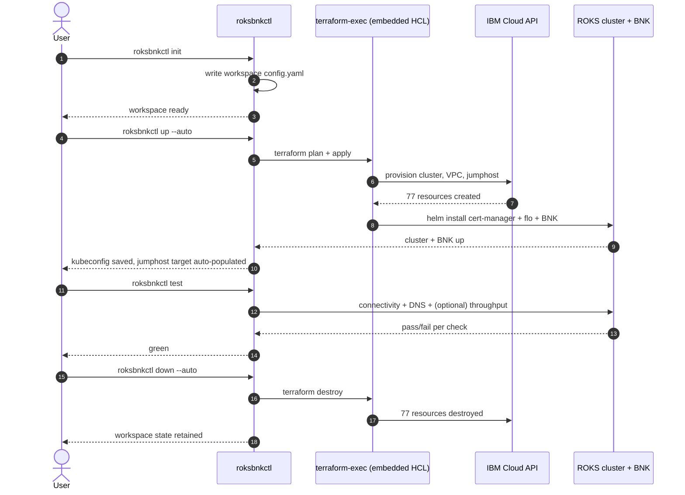

# Quick start: from API key to deployed BNK

This chapter walks the 4-command lifecycle (`init` → `up` → `test` → `down`) end-to-end. By the time you reach the bottom you'll have a deployed BNK trial on a fresh ROKS cluster, a passing connectivity test, and a clean tear-down command ready when you're done.

The lifecycle, at a glance:



The walkthrough assumes:

- You have a `roksbnkctl` binary on `PATH` ([Chapter 4](./04-installation.md)).
- You have an **IBM Cloud API key** for an account with permission to create ROKS clusters.
- `terraform >= 1.10` is on `PATH` and `roksbnkctl doctor` looks healthy ([Chapter 5](./05-doctor.md)). The floor is 1.10, not 1.5: roksbnkctl enforces it (`requireTerraformVersion`) because remote state locking uses terraform's native S3 lockfile ([Chapter 12a](./12a-remote-state.md)).

If `roksbnkctl doctor` is not green for `terraform` and `IBMCLOUD_API_KEY resolves`, fix those first — nothing below will work otherwise.

> **Note.** The output blocks below are illustrative — version strings, cluster IDs, IPs, and timing all vary between runs. The shape of each step is what to look for.

## Step 1 — set the API key

The cleanest way to make `roksbnkctl` see your API key is the `IBMCLOUD_API_KEY` environment variable. `roksbnkctl init` will offer to save it to your OS keychain afterwards, so you only paste it once.

```bash
export IBMCLOUD_API_KEY="ibmcloud-api-key-value-here"
```

If you'd rather not export it in your shell, `roksbnkctl init` will prompt for it on a TTY and offer the same keychain-save afterwards. See [Chapter 14](./14-credentials-resolver.md) for the full resolution chain.

## Step 2 — `roksbnkctl init`

Initialises a workspace under `~/.roksbnkctl/default/` (or under `<name>/` if you pass `-w <name>`). Verifies the API key against IBM IAM, resolves the resource group, and writes `config.yaml`.

> **Flag-value syntax.** Short flags accept their value as `-w value` (one space) or `-w=value` (immediate equals); the stuck-together form `-wvalue` is rejected at parse time before any workspace dir is created. The same rule applies to every short flag (`-w`, `-f`, `-n`, `-c`, `-l`, `-o`). Long flags follow the same two shapes: `--workspace value` or `--workspace=value`. So if you typo the long-flag name as a short — e.g. `roksbnkctl init -ws canada-roks --config-file ./config.yaml` — the binary rejects it immediately with:
>
> ```
> roksbnkctl: "-ws" is not a recognised flag (looks like a stuck-together short-flag-value, which this binary does not accept).
> Use one of these forms instead:
>   -w s              (short, space)
>   -w=s              (short, equals)
>   --workspace s     (long, space)
>   --workspace=s     (long, equals)
> Did you mean '--workspace s'?
> ```
>
> Recovery is what the error names: re-run with `--workspace canada-roks` (or `-w canada-roks`).

```bash
roksbnkctl init
```

`init` **interviews your account**: after it verifies the API key it asks whether to create a new cluster, then lists the regions (or the existing clusters) your credentials can reach — you pick from a menu instead of typing free-text.

Sample interactive session (creating a new cluster):

```
roksbnkctl init
  Workspace name [default]:
→ Verifying IBM Cloud credentials ... ✓ you@example.com (account 1a2b3c...)
  Create a new ROKS cluster? [Y/n]: y
  Region for the new cluster:
       1) au-syd
       2) br-sao
     * 3) ca-tor
       ...
      10) us-south
  Choice [1-14] [3]: 10
  Workspace prefix [bnk-quickstart]:
  Workers per zone (min 1; cluster spans all 3 AZs) [1]: 2
  OpenShift version [4.18]:
  Create registry COS instance? [Y/n]: y
  Resource group [default]:
→ ✓ Resource group "default" (id ...)
  Create Transit Gateway? [Y/n]: y
  Install cert-manager? [Y/n]: y
  Deploy BIG-IP Next (BNK)? [Y/n]: y
  Add a testing client? [y/N]: y
  Region to install the test client in:
      ...
  Choice [1-14] [10]: 3
  Create a new client VPC for it? [Y/n]: y
  Create per-zone cluster jumphosts? [y/N]: n
  Save IBMCLOUD_API_KEY to OS keychain for this workspace? (y/N): y
✓ Current workspace: default
✓ Wrote ~/.roksbnkctl/default/config.yaml
```

What just happened:

- A workspace called `default` now exists at `~/.roksbnkctl/default/` and is **current** — the next bare command runs against it (no separate `ws use` needed).
- You picked the region from the account's **available regions**; the cluster spans **all three availability zones** with `workers-per-zone × 3` workers. One per zone (3 total) is the minimum — a ROKS cluster is always multi-AZ, so `init` floors the count there.
- The optional **testing client** (TGW jumphost + client VPC) can live in a **different region** from the cluster — you're prompted for its region separately.
- `config.yaml` records the region, resource group, prefix, worker sizing, the per-resource `resources:` toggles, and BNK component defaults. The API key is saved to your OS keychain (macOS Keychain, libsecret on Linux, or Windows Credential Manager) under service `roksbnkctl`; subsequent runs resolve it from there without prompting.

You can re-run `roksbnkctl init` to update workspace settings; existing values become the prompt defaults.

### Reusing an existing cluster

Answer **n** to *Create a new ROKS cluster?* and `init` lists the account's running OpenShift clusters to pick one:

```
  Create a new ROKS cluster? [Y/n]: n
→ Listing running OpenShift clusters...
  Choose an existing cluster:
     * 1) bnk-demo        (us-south, 4.18.x_openshift)
       2) roks-prod-ca    (ca-tor, 4.19.x_openshift)
  Choice [1-2] [1]: 1
```

The chosen cluster's region and name are recorded, and `init` populates `cluster-outputs.json` — the same identity file [`cluster register`](./09-registering-existing-cluster.md) writes — so a subsequent `roksbnkctl up` deploys BNK straight onto it, with no `cluster up` and no separate `register` step.

## Step 3 — `roksbnkctl up --auto`

The deployment. Runs `terraform plan`, runs `terraform apply`, fetches the admin kubeconfig from IBM Cloud, writes it to `~/.kube/config` at mode 0600. The `--auto` flag skips the plan-and-confirm gate; without it `up` shows the plan and asks "apply? [y/N]" before continuing.

```bash
roksbnkctl up --auto
```

Sample output (heavily abridged — a real run is ~50 minutes and prints terraform's full plan + apply log):

```
roksbnkctl up --auto
→ Resolving terraform source ... embedded (v1.0.0)
→ Extracting bundled HCL to ~/.roksbnkctl/default/state/tf-source/embedded-terraform/
→ Pre-creating kubeconfig + scratch directories
→ Rendering auto-tfvars from config.yaml ... ok
→ terraform init -reconfigure
  Initializing provider plugins... done.
→ terraform apply (auto-approved)
  module.roks_cluster.ibm_container_vpc_cluster.cluster: Creating...
  module.roks_cluster.ibm_container_vpc_cluster.cluster: Still creating... [10m elapsed]
  module.roks_cluster.ibm_container_vpc_cluster.cluster: Still creating... [20m elapsed]
  module.roks_cluster.ibm_container_vpc_cluster.cluster: Still creating... [30m elapsed]
  module.roks_cluster.ibm_container_vpc_cluster.cluster: Creation complete after 38m12s
  module.cert_manager.helm_release.cert_manager: Creation complete after 2m11s
  module.flo.helm_release.flo: Creation complete after 4m02s
  module.cne_instance.kubernetes_manifest.cne_instance: Creation complete after 1m42s
  module.license.helm_release.license: Creation complete after 2m18s
  module.testing.tls_private_key.jumphost_shared_key: Creation complete after 0s
  module.testing.ibm_is_instance.tgw_jumphost: Creation complete after 1m48s

  Apply complete! Resources: 77 added, 0 changed, 0 destroyed.

→ Fetching admin kubeconfig for cluster "<cluster-id>"
✓ Wrote /home/you/.kube/config (chmod 0600)
✓ Auto-registered target jumphost (169.45.91.177); use `roksbnkctl --on jumphost ...`
```

What just happened:

- 77 resources were created across ROKS, cert-manager, FLO, CNE Instance, BNK license, and a small testing footprint (the TGW jumphost).
- An admin kubeconfig was fetched directly from IBM Cloud's container service API (no `ibmcloud ks cluster config` shell-out) and written at mode 0600.
- A `jumphost` target was auto-populated in your workspace config from terraform outputs. This makes [Chapter 16](./16-on-flag-ssh-jumphosts.md)'s `--on jumphost` flag work without any further configuration.

The actual elapsed time on a fresh run is dominated by ROKS cluster creation (~30-40 min) and cert-manager + FLO Helm install (~10 min). Re-runs are dramatically faster because terraform's idempotence skips already-created resources.

## Step 4 — `roksbnkctl status`

Quick sanity check: workspace pointer is right, cluster is reachable, BNK pods are healthy.

```bash
roksbnkctl status
```

Sample output:

```
Workspace: default
Region:    us-south
RG:        Default (id: ...)
Cluster:   bnk-quickstart (id: <cluster-id>) — Ready
TF source: embedded (v1.0.0)
Last apply: 2026-05-08T14:22:08Z
Nodes:     2/2 Ready
BNK pods:  flo (3/3), cis (1/1), cert-manager (3/3), cne-instance (1/1)
```

If anything is not green here, jump to [Chapter 26 — Troubleshooting](./26-troubleshooting.md).

## Step 5 — `roksbnkctl test`

Run the built-in validation suite. Bare `test` runs the connectivity + DNS checks (the throughput test takes a few minutes and is opt-in).

```bash
roksbnkctl test
```

Sample output:

```
roksbnkctl test
→ Suite: connectivity
  ✓ https://www.f5.com (200, 312ms)
  ✓ https://api.openshift.com (200, 88ms)
  ✓ https://us-south.containers.cloud.ibm.com (200, 142ms)
→ Suite: dns
  ✓ www.f5.com → 23.50.149.94 (A, 12ms)
  ✓ api.openshift.com → 35.190.27.231 (A, 18ms)

3 connectivity checks passed; 2 DNS checks passed; 0 failed.
```

For the throughput suite specifically:

```bash
roksbnkctl test throughput --mode east-west
```

Sample output:

```
→ Deploying iperf3 server pod into namespace "roksbnkctl-test"
✓ Pod ready (iperf3-server-...)
→ Exposing via ClusterIP service
✓ Service ready (cluster-ip: 172.21.45.108:5201)
→ Running iperf3 -c against the service from local
✓ throughput: 9.41 Gbits/sec (mean over 10s)
→ Tearing down iperf3 fixture
✓ pod and service deleted
```

The `--mode east-west` flag uses a `ClusterIP` service and runs the host iperf3 client through `oc port-forward` for in-cluster traffic; `--mode north-south` uses a `LoadBalancer` for outside-the-cluster traffic. See [Chapter 22](./22-throughput-testing.md) for the full design.

The connectivity test uses Go's built-in `net/http` — no external `curl` is shelled out — and similarly DNS uses Go's `net.Resolver`. The `--insecure` flag on `test connectivity` skips TLS validation if you need to test against self-signed endpoints.

## Step 6 — explore (optional)

A few useful follow-ups now that the cluster's up:

```bash
# tail the F5 Lifecycle Operator logs
roksbnkctl logs flo -f

# drop into a shell with the workspace's KUBECONFIG + IBMCLOUD_API_KEY exported
roksbnkctl shell

# run a one-shot kubectl with the workspace context loaded
roksbnkctl kubectl get pods -A

# run ibmcloud through the auto-discovered jumphost
roksbnkctl ibmcloud --on jumphost ks cluster ls
```

The `--on jumphost` flag is covered in detail in [Chapter 16](./16-on-flag-ssh-jumphosts.md). It lets you run any of the passthrough commands (`exec`, `shell`, `kubectl`, `oc`, `ibmcloud`) from inside the cluster's network — useful when your workstation is behind a corporate firewall that can't reach IBM Cloud directly.

## Step 7 — `roksbnkctl down --auto`

Tear it all back down when you're finished. The teardown is `terraform destroy` under the hood, with the same resilience to transient IBM API errors as `up`.

```bash
roksbnkctl down --auto
```

Sample output:

```
roksbnkctl down --auto
→ terraform destroy (auto-approved)
  module.testing.ibm_is_instance.tgw_jumphost: Destroying...
  ...
  module.roks_cluster.ibm_container_vpc_cluster.cluster: Destroying...
  module.roks_cluster.ibm_container_vpc_cluster.cluster: Still destroying... [5m elapsed]
  module.roks_cluster.ibm_container_vpc_cluster.cluster: Destruction complete after 8m16s

  Destroy complete! Resources: 77 destroyed.

✓ Workspace "default" state retained at ~/.roksbnkctl/default/
  (run `roksbnkctl ws delete default` to remove the workspace dir)
```

`down` retains the workspace dir and config so you can `up` again with the same settings. To remove the workspace entirely:

```bash
roksbnkctl ws delete default
```

This refuses if terraform state still lists resources (use `--force` to override) and cleans up the keychain entry.

## What you just did

In effectively three commands you:

1. Provisioned a fresh ROKS cluster on IBM Cloud.
2. Installed cert-manager, F5 Lifecycle Operator, and a complete BNK trial on top of it.
3. Validated the deployment with HTTP connectivity + DNS resolution + (optionally) throughput tests.
4. Got an auto-discovered jumphost target ready for any `--on jumphost` follow-ups.

The same flow runs against multiple workspaces, multiple regions, and multiple resource groups — see [Chapter 6](./06-workspaces.md) for the multi-environment patterns. From here, [Chapter 16](./16-on-flag-ssh-jumphosts.md) covers the `--on` flag, [Chapter 24](./24-day-2-ops.md) covers day-2 operations, and [Chapter 26](./26-troubleshooting.md) covers what to do when one of the above steps doesn't go right.
