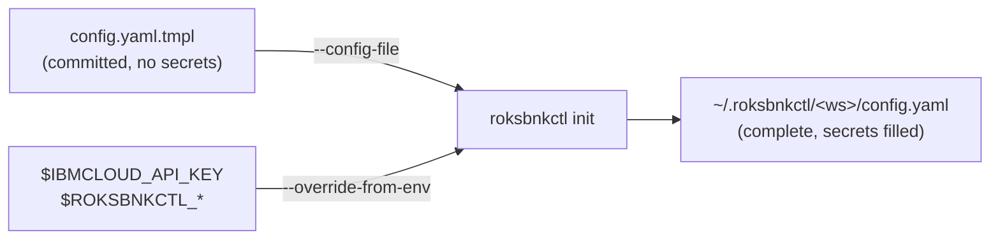

# Unattended setup: seeding a workspace from a file, URL, or environment

The [quick start](./07-quick-start.md) drives `init` interactively. A CI pipeline
or a fleet operator wants the opposite: hand `init` a finished config, fetch it
from a URL, and inject secrets from the environment so a single committed
template stands up many workspaces without ever baking an API key into version
control.

Three `init` options make that work:

| Option | What it does |
|---|---|
| `--config-file <path\|url>` | Seed the workspace `config.yaml` directly (no interview) |
| `--override-from-env` | Overlay specific `config.yaml` fields from environment variables |
| `--non-interactive` | Build `config.yaml` from environment variables alone — no file, no prompt (argv+env runners) |

## The pattern



Commit a template with the secret fields blank, and let the pipeline supply the
real values from its environment:

```yaml
# config.yaml.tmpl — committed to git, no secrets
ibmcloud:
  region: ""              # ← ROKSBNKCTL_REGION
  resource_group: ""      # ← ROKSBNKCTL_RESOURCE_GROUP
  api_key_b64: ""         # ← IBMCLOUD_API_KEY (raw, base64-encoded)
prefix: ""                # ← ROKSBNKCTL_PREFIX
cluster: { create: true, name: "" }
tf_source: { type: embedded }
resources:
  bnk: { create: true }
  tgw_jumphost: { create: true }
  client_vpc: { create: true }
```

```bash
export IBMCLOUD_API_KEY="$(vault read -field=key secret/ibmcloud)"
export ROKSBNKCTL_REGION=eu-de
export ROKSBNKCTL_RESOURCE_GROUP=default
export ROKSBNKCTL_PREFIX=ci-run-42

roksbnkctl init -w ci-run-42 \
  --config-file https://raw.githubusercontent.com/acme/infra/main/config.yaml.tmpl \
  --override-from-env
```

No secret ever lands in git; the same template seeds every account.

## Exit codes

Unattended callers branch on `$?`, so the codes are an interface:

| code | meaning |
|---:|---|
| `0` | The command did what was asked. |
| `1` | It went wrong. The default for anything without a more specific code. |
| `2` | The **invocation** was rejected — a malformed flag, an argument the command cannot accept. Nothing was attempted. |
| `126` | Permission denied: SSH authentication, a host-key mismatch, a credential the remote end refused. |
| `127` | The target could not be reached at all. |
| `130` | The operator interrupted it (Ctrl-C / `SIGINT`). |
| `125` | **`upgrade` / `self update` only.** The upgrade removed the old binary and could not put anything back, so there is no `roksbnkctl` at the install path. The message names the `.old` sidecar and the command to rename it. |
| *other* | A wrapped tool's own status, passed through unchanged — `terraform`, `ibmcloud`, and `--on <target>` remote commands all propagate theirs. That includes `125` from any command **other** than `upgrade` / `self update`, which spawn no child. |

`130` is worth wiring into CI cleanup: it distinguishes *"someone stopped this"*
from *"it broke"*, which a job that retries on failure should treat differently.

`125` matters for the same reason, in the opposite direction: an ordinary failed
upgrade is safe to retry, and this one is not — there is nothing left to run. A
wrapper that retries on any non-zero status will loop forever on a machine that
cannot recover until someone renames the sidecar back.
Before v1.50.0 only `roksbnkctl init` produced it — every other command turned
the same Ctrl-C into `1`.

`2` is similarly worth separating. It means the command never ran, so retrying
the same invocation will fail the same way; the fix is in the script, not the
environment.

A command that propagates a wrapped tool's status does not print its own error
on top — `terraform`'s diagnostics have already gone to stderr, and a second
`roksbnkctl: ...` line would only add noise. Check the stream, not just the
code.

### The interrupt outranks everything else

A failure that happens *because* of the Ctrl-C reports the interrupt, not the
failure class it landed in: a connect aborted mid-handshake is `130`, not
`127`; a test suite cut off mid-run is `130`, not a red `1`; a child killed by
the signal propagates `130` (`128+SIGINT`, the shell convention), not `255`.
So `$? -eq 130` is reliable — a job does not need to trap `SIGINT` itself to
tell "someone stopped this" from "it broke".

## `--config-file`

`--config-file` parses the supplied YAML strictly — **unknown fields are
rejected**, not silently dropped — into the workspace `config.yaml`, and skips
the interview entirely. It is **non-interactive when the config is complete**.
A config is complete when it has all of:

- `ibmcloud.region`
- `ibmcloud.resource_group`
- `prefix`
- `tf_source.type`

If any are missing (after `--override-from-env` runs), `init` exits with a clear
message naming exactly which — supply them in the file, set them via the
environment, or run `init` interactively. The API key is **not** required in the
file; it resolves from the environment, keychain, or config at run time as usual
(see [Credentials](./14-credentials-resolver.md)).

## URL inputs

`--config-file` accepts a local path **or** an `http(s)` URL. A URL is fetched
(30 s timeout, 10 MB cap) and treated identically to a local file — a raw-git
URL, a presigned IBM COS URL, or any reachable endpoint. There is no fetch
authentication in this release; use a presigned or public URL.

## `--override-from-env`

`--override-from-env` overlays a **fixed set** of `config.yaml` fields from
environment variables that are set and non-empty, after the file/interview has
produced the config. **The environment wins** over the seeded value — it is the
explicit late-binding step. This is a fixed field map, not arbitrary templating.

| Environment variable | `config.yaml` field | Encoding |
|---|---|---|
| `IBMCLOUD_API_KEY` | `ibmcloud.api_key_b64` | raw key, base64-encoded |
| `ROKSBNKCTL_API_KEY_B64` | `ibmcloud.api_key_b64` | verbatim (pre-encoded) |
| `ROKSBNKCTL_PREFIX` | `prefix` | verbatim |
| `ROKSBNKCTL_REGION` | `ibmcloud.region` | verbatim |
| `ROKSBNKCTL_RESOURCE_GROUP` | `ibmcloud.resource_group` | verbatim |
| `ROKSBNKCTL_CLUSTER_NAME` | `cluster.name` | verbatim |
| `ROKSBNKCTL_CLUSTER_CREATE` | `cluster.create` | bool (`true`/`false`/`1`/`0`) |
| `ROKSBNKCTL_OPENSHIFT_VERSION` | `cluster.openshift_version` | verbatim |
| `ROKSBNKCTL_WORKERS_PER_ZONE` | `cluster.workers_per_zone` | integer |
| `ROKSBNKCTL_CLUSTER_PUBLIC_GATEWAY` | `cluster.public_gateway` | bool — `false` builds a **disconnected** cluster whose workers have no Internet egress. Unset inherits the terraform default (`true`). |
| `ROKSBNKCTL_TRUSTED_PROFILE_SA` | `bnk.trusted_profile.service_account` | Kubernetes account allowed to assume the CNE controller's IBM Cloud Trusted Profile. Must match the account the FLO chart creates. |
| `ROKSBNKCTL_TRUSTED_PROFILE_ROLES` | `bnk.trusted_profile.roles` | IAM roles for that profile, scoped to the cluster's own VPC. **Comma-separated.** An unparseable entry is dropped. |
| `ROKSBNKCTL_VLAN_PREFIXLEN` | `bnk.network.vlan_prefixlen` | TMM self-IP mask. **Independent of the zone CIDRs and never derived from them** — a deliberate disagreement, plus static routes, is how a traffic pattern is forced. Out-of-range values are **silently ignored** and the terraform default stands. |
| `ROKSBNKCTL_VLAN_PREFIXLEN_EXTERNAL` | `bnk.network.vlan_prefixlen_external` | Overrides the shared mask for the external VLAN only. Unset = inherit. Silently ignored if out of range. |
| `ROKSBNKCTL_VLAN_PREFIXLEN_INTERNAL` | `bnk.network.vlan_prefixlen_internal` | Same, internal VLAN. The two need not match. |
| `ROKSBNKCTL_GTM_URL` | `bnk.gtm.url` | BIG-IP DNS / GTM the GSLB datacenter registers **with**. Without it, `gslb_datacenter_name` is a label pointing at nothing. |
| `ROKSBNKCTL_GTM_USERNAME` | `bnk.gtm.username` | GTM user. |
| `ROKSBNKCTL_GTM_PASSWORD` | `bnk.gtm.password_b64` | GTM password — supplied **raw**, stored base64 (like `IBMCLOUD_API_KEY` and `ROKSBNKCTL_BIGIP_PASSWORD`). |
| `ROKSBNKCTL_GENERIC_CA_B64` | `registry.generic_ca_b64` | Mirror CA, **verbatim** — already base64, not re-encoded. |
| `ROKSBNKCTL_GENERIC_CA_SHA256` | `registry.generic_ca_sha256` | The out-of-band CA pin. |
| `ROKSBNKCTL_REACHABILITY_RETRY_SECONDS` | `bnk.preflight.reachability_retry_seconds` | Per-target retry window before the verdict is believed. |
| `ROKSBNKCTL_REACHABILITY_TIMEOUT_SECONDS` | `bnk.preflight.reachability_timeout_seconds` | Total wait for every node to report. |
| `ROKSBNKCTL_CLUSTER_NETWORK_MODE` | `cluster.network_mode` | How the workers are attached: `single-nic` (default) or `multi-nic`. Create-time only. Exists for exactly this chapter's case — a runner that never writes a `config.yaml` would otherwise have no way to ask for it. |
| `ROKSBNKCTL_CLUSTER_VPC_CIDR` | `cluster.vpc_cidr` | CIDR (`/18` or larger) for a **new** cluster VPC's per-zone address prefixes. Unset = IBM `auto`, which is the SAME block for every VPC in the region — set a distinct one per cluster when two share a Transit Gateway, or the gateway silently blackholes one. See [Chapter 9a](./09a-transit-gateway-sharing.md#first-give-each-cluster-vpc-its-own-address-block). |
| `ROKSBNKCTL_TRANSIT_GATEWAY_NAME` | `resources.transit_gateway` (`create:false` + `existing`) | a Transit Gateway **name or id** — `cluster up`/`register` attaches the cluster VPC to it (see [Sharing a Transit Gateway](./09a-transit-gateway-sharing.md)) |
| `ROKSBNKCTL_EXISTING_SUBNET_IDS` | `cluster.existing_subnet_ids` | Place the cluster in subnets that already exist. Comma-separated, **in zone order** — each subnet's zone is read from the subnet, so a reordered list places the cluster differently. Requires `resources.cluster_vpc: {create: false, existing: <vpc-id>}`. |
| `ROKSBNKCTL_FLP_VSI_CREATE_VPC` | `bnk.flp.vsi.create_vpc` | Give the FLP VSI its **own** VPC instead of placing it in one that exists. This is what lets the proxy be the first thing deployed in an air-gapped estate. Mutually exclusive with `ROKSBNKCTL_FLP_VSI_VPC`. |
| `ROKSBNKCTL_FLP_VSI_VPC_NAME` | `bnk.flp.vsi.vpc_name` | Name for that VPC. Empty → `flp-vsi-vpc`. |
| `ROKSBNKCTL_FLP_VSI_SUBNET_CIDR` | `bnk.flp.vsi.subnet_cidr` | Its address prefix. Must not overlap anything the consuming clusters can already route to — a transit gateway silently blackholes one of two overlapping VPCs. |
| `ROKSBNKCTL_CLUSTER_VPC_ID` | `resources.cluster_vpc` (`create:false` + `existing`) | verbatim — adopt an existing cluster VPC by **ID** |
| `ROKSBNKCTL_TESTING_VPC_NAME` | `resources.testing_client_vpc_name` | verbatim (names the client VPC to create) |
| `ROKSBNKCTL_TGW_JUMPHOST_CREATE` | `resources.tgw_jumphost.create` | bool — the optional testing jumphost. Defaults **off**, as the interview does. |
| `ROKSBNKCTL_CLIENT_VPC_CREATE` | `resources.client_vpc.create` | bool — the testing client VPC. Defaults **off**; it consumes a Transit Gateway connection. |
| `ROKSBNKCTL_CLIENT_VPC_NAME` | `resources.client_vpc.existing` | Adopt an existing client VPC instead of creating one — the env equivalent of the interview's *"Existing client VPC name"*. Required if you enable the jumphost without creating a VPC. |
| `ROKSBNKCTL_BIGIP_URL` | `bnk.cis.bigip_url` | verbatim |
| `ROKSBNKCTL_BIGIP_USERNAME` | `bnk.cis.bigip_username` | verbatim |
| `ROKSBNKCTL_BIGIP_PASSWORD` | `bnk.cis.bigip_password_b64` | raw, base64-encoded |
| `ROKSBNKCTL_ZONE<n>_EXT_VLAN_CIDR` … `_INTERNAL_SELFIP` | `bnk.network.zones[n-1]` | per-zone VLAN/SNAT/VIP CIDRs + self-IPs (n = 1…3; all six fields required for a zone to apply) |
| `ROKSBNKCTL_TESTING_SSH_KEY_NAME` | `resources.testing_ssh_key_name` | verbatim |
| `ROKSBNKCTL_BNKFORGE_CA_B64` | `bnkforge.ca_b64` | PEM CA the BNK Forge server's certificate must chain to, base64-encoded. Pins a self-signed lab cert so the session token is not sent over an unauthenticated connection. Supersedes `bnkforge.insecure`. |
| `ROKSBNKCTL_TESTING_JUMPHOST_ALLOWED_CIDRS` | `resources.testing_jumphost_allowed_cidrs` | comma-separated source CIDRs for SSH (:22) to the testing jumphosts. Unset → open (they carry a public floating IP; access is key-only). Set to your public /32 on a shared account. |
| `ROKSBNKCTL_TESTING_CLIENT_VPC_INBOUND_CIDRS` | `resources.testing_client_vpc_inbound_cidrs` | comma-separated; inbound to the testing client VPC's **default** SG. Unset → the RFC-1918 ranges (in-fabric test traffic arrives over the Transit Gateway). |
| `ROKSBNKCTL_CLUSTER_HTTP_ALLOWED_CIDRS` | `resources.cluster_http_allowed_cidrs` | comma-separated; sources for :80 on the cluster SG. Unset → open (this is the ingress/ALB path). |
| `ROKSBNKCTL_CLUSTER_VPC_DEFAULT_SG_INBOUND_CIDRS` | `resources.cluster_vpc_default_sg_inbound_cidrs` | comma-separated; inbound (all protocols/ports) to the cluster VPC's **default** SG. Unset → open, the historical behaviour. |
| `ROKSBNKCTL_REGISTRY_TARGET` | `registry.target` | `icr` \| `generic` |
| `ROKSBNKCTL_GENERIC_HOST` | `registry.generic_host` | verbatim, e.g. `harbor.example.com` |
| `ROKSBNKCTL_GENERIC_REPO_PREFIX` | `registry.generic_repo_prefix` | verbatim — a Harbor project, an Artifactory repo key |
| `ROKSBNKCTL_GENERIC_USERNAME` | `registry.generic_username` | verbatim |
| `ROKSBNKCTL_GENERIC_PASSWORD` | `registry.generic_password_b64` | raw, base64-encoded |
| `ROKSBNKCTL_LICENSE_MODE` | `bnk.license_mode` | `connected` \| `disconnected` \| `f5licenseproxy` (see [Chapter 10c](./10c-flp-licensing.md)) |
| `ROKSBNKCTL_FLO_NAMESPACE` | `bnk.flo_namespace` | Namespace FLO installs into. Default `f5-bnk`. |
| `ROKSBNKCTL_FLO_UTILS_NAMESPACE` | `bnk.flo_utils_namespace` | Namespace for the F5 utility components. Default `f5-utils`. **Set both to the same value for one shared namespace** — verified against BNK 2.3. |
| `ROKSBNKCTL_GATEWAY_CLASS_NAME` | `gateway.class_name` | GatewayClass name; blank → `gateway-class`. GatewayClass is **cluster-scoped**, so two BNK installs sharing a cluster must not share it. |
| `ROKSBNKCTL_GATEWAY_CONTROLLER_NAME` | `gateway.controller_name` | **Leave blank.** Blank derives `f5.com/<flo_namespace>-f5-cne-controller` — the value the CNE controller answers to — and follows `ROKSBNKCTL_FLO_NAMESPACE` automatically. Set it only to aim the GatewayClass at a controller this deployment did not install. A wrong value fails **silently**: the apply succeeds, the GatewayClass is never `Accepted`, and no traffic flows. |
| `ROKSBNKCTL_GATEWAY_ROUTE_EXAMPLES` | `gateway.route_examples` | Comma-separated extra route kinds to create working examples of. On BNK 2.3: `GRPCRoute`, `L4Route`. Blank leaves an existing deployment byte-identical. `TCPRoute` is **not** valid — 2.3 pins Gateway API 1.4.1 *standard*, which does not contain it; BNK uses its own `L4Route` for TCP. |
| `ROKSBNKCTL_GATEWAY_L4_LISTENER_PORT` | `gateway.l4_listener_port` | Port for the TCP listener `L4Route` needs. Blank → `8080`. |
| `ROKSBNKCTL_FLP_NAMESPACE` | `bnk.flp.namespace` | verbatim (FLP mode only) |
| `ROKSBNKCTL_FLP_EXTERNAL_URL` | `bnk.flp.external.url` | verbatim — license against a proxy in **another** cluster |
| `ROKSBNKCTL_FLP_ROOT_CA_B64` | `bnk.flp.external.root_ca_b64` | **verbatim; already base64** — re-encoding it hands the CWC a corrupt CA |
| `ROKSBNKCTL_FLP_MODE` | `bnk.flp.mode` | `helm` (default) \| `vsi` — how the FLP phase deploys the proxy |
| `ROKSBNKCTL_FLP_VSI_NAME_PREFIX` | `bnk.flp.vsi.name_prefix` | Prefixes the FLP VSI's resource names. **Blank keeps the legacy unprefixed names** — setting it *replaces* a running proxy. Needed to run more than one FLP in an account, and to make the proxy's resources visible to `cleanup`'s `<prefix>-*` sweep. |
| `ROKSBNKCTL_FLP_VSI_VPC` | `bnk.flp.vsi.vpc` | an **existing VPC id**. With `_MODE=vsi` this arms the **standalone, cluster-less** appliance — as does `_CREATE_VPC=true`, which builds one instead. Mutually exclusive. |
| `ROKSBNKCTL_FLP_VSI_ZONE` | `bnk.flp.vsi.zone` | e.g. `us-south-1`; blank → the region's first zone |
| `ROKSBNKCTL_FLP_VSI_PROFILE` | `bnk.flp.vsi.profile` | VSI instance profile; blank → `bx2-4x16` (the FLP's 4 vCPU / 8 GB floor) |
| `ROKSBNKCTL_FLP_VSI_SSH_KEY` | `bnk.flp.vsi.ssh_key` | name of an existing IBM Cloud VPC SSH key |
| `ROKSBNKCTL_FLP_VSI_BOOT_SIZE_GB` | `bnk.flp.vsi.boot_size_gb` | integer; blank → 100 |
| `ROKSBNKCTL_FLP_VSI_REACH` | `bnk.flp.vsi.reach` | `private` (default) \| `floating` — the address the CWC dials |
| `ROKSBNKCTL_FLP_VSI_FLOATING_IP` | `bnk.flp.vsi.floating_ip` | bool; an unparseable value leaves the **module default (true)** rather than pinning false |
| `ROKSBNKCTL_FLP_VSI_MANAGEMENT_ALLOWED_CIDRS` | `bnk.flp.vsi.management_allowed_cidrs` | **comma-separated** list — gates the `:80` status UI |
| `ROKSBNKCTL_FLP_VSI_LICENSING_ALLOWED_CIDRS` | `bnk.flp.vsi.licensing_allowed_cidrs` | **comma-separated** list — gates the `:8443` proxy + `:22` |
| `ROKSBNKCTL_FLP_VSI_STATUS_IMAGE` | `bnk.flp.vsi.status_image` | the `flp-status` web-UI image, e.g. `<harbor>/bnk-status/flp-status:v1` |
| `ROKSBNKCTL_FLP_VSI_STATUS_REGISTRY_HOST` | `bnk.flp.vsi.status_registry_host` | verbatim — the mirror the status image is pulled from |
| `ROKSBNKCTL_FLP_VSI_STATUS_REGISTRY_CA_B64` | `bnk.flp.vsi.status_registry_ca_b64` | **verbatim; already base64** — the mirror's CA, dropped into the VSI's `certs.d` |
| `ROKSBNKCTL_MANIFEST_VERSION` | `bnk.manifest_version` | verbatim — the BNK manifest release |
| `ROKSBNKCTL_FAR_AUTH_LOCAL_FILE` | `bnk.far_auth_local_file` | path to the FAR auth tarball **in the run workspace** |
| `ROKSBNKCTL_SUBSCRIPTION_JWT_LOCAL_FILE` | `bnk.subscription_jwt_local_file` | path to the subscription JWT. Set **both** local-file vars and the COS download is skipped (`use_cos_bucket = false`) |
| `ROKSBNKCTL_COS_INSTANCE` | `cos.instance` | verbatim; blank → `bnk-supply-chain` |
| `ROKSBNKCTL_COS_BUCKET` | `cos.bucket` | verbatim; blank → `bnk-artifacts` |
| `ROKSBNKCTL_COS_REGION` | `cos.region` | verbatim; blank → `us-south` |
| `ROKSBNKCTL_FAR_AUTH_FILE` | `bnk.far_auth_file` | object name in the bucket; blank → `f5-far-auth-key.tgz` |
| `ROKSBNKCTL_SUBSCRIPTION_JWT_FILE` | `bnk.subscription_jwt_file` | object name in the bucket; blank → `subscription.jwt` |

The FLP-VSI block reproduces, from environment variables alone, the standalone
licensing appliance the [disconnected-cluster walkthrough](./appendix-a-disconnected-roks-cluster.md)
builds from a hand-written `config.yaml` — for an **argv-only** runner (a CI
container, BNK Forge's container engine) that has no shell to write a YAML file
with. `bnk.flp.mode: vsi` **plus a network** selects the cluster-less path — either
`bnk.flp.vsi.vpc` (adopt an existing VPC) or `bnk.flp.vsi.create_vpc: true` (build
one). The two are mutually exclusive; the mode alone leaves the cluster-required
behaviour.

The supply-chain block matters because the COS fallbacks were **renamed in
v1.22.0** (`bnk-orchestration` → `bnk-supply-chain`, `bnk-schematics-resources` →
`bnk-artifacts`, `trial.jwt` → `subscription.jwt`). Before these variables existed
a runner that could not write a `config.yaml` was pinned to whatever the defaults
happened to be; an account still holding the pre-v1.22 layout can now say so.

The FLP/registry handoff vars are what turn a CI pipeline into a workspace with no `config.yaml` to
template. The registry four say *where* the mirror is; the FLP two are the **cross-job
handoff** — the job that owns the proxy prints them with `flp output
flp_external_endpoint` / `flp_root_ca`, and the job that installs BNK receives them as
ordinary job outputs. See [Flow C in CI](./10c-flp-licensing.md#flow-c-in-ci--the-runner-container-no-host-install).

Notes:

- For the API key, `IBMCLOUD_API_KEY` holds the **raw** key and `init`
  base64-encodes it into `api_key_b64` (matching how the rest of the tool reads
  `IBMCLOUD_API_KEY`). If you already have the base64 form, set
  `ROKSBNKCTL_API_KEY_B64` instead — it takes precedence and is stored verbatim.
- `init` logs how many overrides were applied and which fields — **never the
  values**, so secrets stay out of CI logs.
- `--override-from-env` also applies on the interactive path, so you can answer
  the interview and still pull the API key from the environment.

## `--non-interactive` — config from the environment alone

`--override-from-env` *overlays* env onto a file or interview. `--non-interactive`
goes further: it builds `config.yaml` **entirely from the environment** — no
`--config-file`, no prompts, no TTY. It is the path for an **argv + env container
runner** (a CI job, or a [BNK Forge](./24a-bnk-forge-registration.md) container
step) that can pass environment variables and arguments but cannot stage a seed
file.

```bash
roksbnkctl -w forge init --non-interactive
```

It assembles the workspace from the same `ROKSBNKCTL_*` / `IBMCLOUD_API_KEY`
variables in the table above, then:

- defaults `tf_source.type` to `embedded` (the one required field with no env
  override — an empty type already means "embedded" at render time);
- validates completeness and **fails fast** if a required field is missing
  (`ibmcloud.region`, `ibmcloud.resource_group`, `prefix`, `tf_source.type`) —
  it never falls back to a prompt;
- logs which fields were applied (never the values).

A complete one-shot, file-free setup:

```bash
export IBMCLOUD_API_KEY=…              # raw key → ibmcloud.api_key_b64
export ROKSBNKCTL_REGION=eu-de
export ROKSBNKCTL_RESOURCE_GROUP=default
export ROKSBNKCTL_PREFIX=acme-eu
export ROKSBNKCTL_CLUSTER_NAME=acme-eu-roks
export ROKSBNKCTL_CLUSTER_CREATE=true

roksbnkctl -w forge init --non-interactive
roksbnkctl -w forge cluster up --auto
roksbnkctl -w forge bnk up --auto
```

This is exactly how the [all-in-one runner image](./04-installation.md#path-c--run-from-the-all-in-one-container-image-no-install)
is meant to be driven from a pipeline: every step is `roksbnkctl <args>` with the
config supplied through the environment, and state persisted on the mounted
`/work` volume (`ROKSBNKCTL_HOME=/work/.roksbnkctl`).
