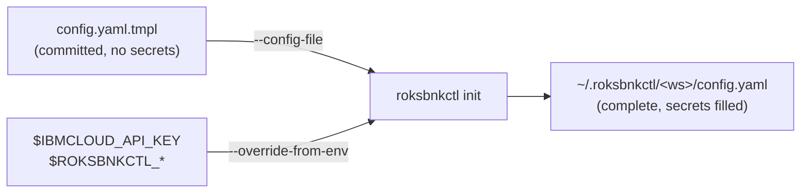

# Unattended setup: seeding a workspace from a file, URL, or environment

The [quick start](./07-quick-start.md) drives `init` interactively. A CI pipeline
or a fleet operator wants the opposite: hand `init` a finished config, fetch it
from a URL, and inject secrets from the environment so a single committed
template stands up many workspaces without ever baking an API key into version
control.

Three `init` options make that work:

| Option | What it does |
|---|---|
| `--config-file <path\|url>` | Seed the workspace `config.yaml` directly (no interview) |
| `--override-from-env` | Overlay specific `config.yaml` fields from environment variables |
| `--non-interactive` | Build `config.yaml` from environment variables alone — no file, no prompt (argv+env runners) |

## The pattern



Commit a template with the secret fields blank, and let the pipeline supply the
real values from its environment:

```yaml
# config.yaml.tmpl — committed to git, no secrets
ibmcloud:
  region: ""              # ← ROKSBNKCTL_REGION
  resource_group: ""      # ← ROKSBNKCTL_RESOURCE_GROUP
  api_key_b64: ""         # ← IBMCLOUD_API_KEY (raw, base64-encoded)
prefix: ""                # ← ROKSBNKCTL_PREFIX
cluster: { create: true, name: "" }
tf_source: { type: embedded }
resources:
  bnk: { create: true }
  tgw_jumphost: { create: true }
  client_vpc: { create: true }
```

```bash
export IBMCLOUD_API_KEY="$(vault read -field=key secret/ibmcloud)"
export ROKSBNKCTL_REGION=eu-de
export ROKSBNKCTL_RESOURCE_GROUP=default
export ROKSBNKCTL_PREFIX=ci-run-42

roksbnkctl init -w ci-run-42 \
  --config-file https://raw.githubusercontent.com/acme/infra/main/config.yaml.tmpl \
  --override-from-env
```

No secret ever lands in git; the same template seeds every account.

## `--config-file`

`--config-file` parses the supplied YAML strictly — **unknown fields are
rejected**, not silently dropped — into the workspace `config.yaml`, and skips
the interview entirely. It is **non-interactive when the config is complete**.
A config is complete when it has all of:

- `ibmcloud.region`
- `ibmcloud.resource_group`
- `prefix`
- `tf_source.type`

If any are missing (after `--override-from-env` runs), `init` exits with a clear
message naming exactly which — supply them in the file, set them via the
environment, or run `init` interactively. The API key is **not** required in the
file; it resolves from the environment, keychain, or config at run time as usual
(see [Credentials](./14-credentials-resolver.md)).

## URL inputs

`--config-file` accepts a local path **or** an `http(s)` URL. A URL is fetched
(30 s timeout, 10 MB cap) and treated identically to a local file — a raw-git
URL, a presigned IBM COS URL, or any reachable endpoint. There is no fetch
authentication in this release; use a presigned or public URL.

## `--override-from-env`

`--override-from-env` overlays a **fixed set** of `config.yaml` fields from
environment variables that are set and non-empty, after the file/interview has
produced the config. **The environment wins** over the seeded value — it is the
explicit late-binding step. This is a fixed field map, not arbitrary templating.

| Environment variable | `config.yaml` field | Encoding |
|---|---|---|
| `IBMCLOUD_API_KEY` | `ibmcloud.api_key_b64` | raw key, base64-encoded |
| `ROKSBNKCTL_API_KEY_B64` | `ibmcloud.api_key_b64` | verbatim (pre-encoded) |
| `ROKSBNKCTL_PREFIX` | `prefix` | verbatim |
| `ROKSBNKCTL_REGION` | `ibmcloud.region` | verbatim |
| `ROKSBNKCTL_RESOURCE_GROUP` | `ibmcloud.resource_group` | verbatim |
| `ROKSBNKCTL_CLUSTER_NAME` | `cluster.name` | verbatim |
| `ROKSBNKCTL_CLUSTER_CREATE` | `cluster.create` | bool (`true`/`false`/`1`/`0`) |
| `ROKSBNKCTL_OPENSHIFT_VERSION` | `cluster.openshift_version` | verbatim |
| `ROKSBNKCTL_WORKERS_PER_ZONE` | `cluster.workers_per_zone` | integer |
| `ROKSBNKCTL_TRANSIT_GATEWAY_NAME` | `resources.transit_gateway` (`create:false` + `existing`) | verbatim (adopt an existing TGW) |
| `ROKSBNKCTL_CLUSTER_VPC_ID` | `resources.cluster_vpc` (`create:false` + `existing`) | verbatim — adopt an existing cluster VPC by **ID** |
| `ROKSBNKCTL_TESTING_VPC_NAME` | `resources.testing_client_vpc_name` | verbatim (names the client VPC to create) |
| `ROKSBNKCTL_BIGIP_URL` | `bnk.cis.bigip_url` | verbatim |
| `ROKSBNKCTL_BIGIP_USERNAME` | `bnk.cis.bigip_username` | verbatim |
| `ROKSBNKCTL_BIGIP_PASSWORD` | `bnk.cis.bigip_password_b64` | raw, base64-encoded |
| `ROKSBNKCTL_ZONE<n>_EXT_VLAN_CIDR` … `_INTERNAL_SELFIP` | `bnk.network.zones[n-1]` | per-zone VLAN/SNAT/VIP CIDRs + self-IPs (n = 1…3; all six fields required for a zone to apply) |
| `ROKSBNKCTL_TESTING_SSH_KEY_NAME` | `resources.testing_ssh_key_name` | verbatim |
| `ROKSBNKCTL_GENERIC_PASSWORD` | `registry.generic_password_b64` | raw, base64-encoded |

Notes:

- For the API key, `IBMCLOUD_API_KEY` holds the **raw** key and `init`
  base64-encodes it into `api_key_b64` (matching how the rest of the tool reads
  `IBMCLOUD_API_KEY`). If you already have the base64 form, set
  `ROKSBNKCTL_API_KEY_B64` instead — it takes precedence and is stored verbatim.
- `init` logs how many overrides were applied and which fields — **never the
  values**, so secrets stay out of CI logs.
- `--override-from-env` also applies on the interactive path, so you can answer
  the interview and still pull the API key from the environment.

## `--non-interactive` — config from the environment alone

`--override-from-env` *overlays* env onto a file or interview. `--non-interactive`
goes further: it builds `config.yaml` **entirely from the environment** — no
`--config-file`, no prompts, no TTY. It is the path for an **argv + env container
runner** (a CI job, or a [BNK Forge](./24a-bnk-forge-registration.md) container
step) that can pass environment variables and arguments but cannot stage a seed
file.

```bash
roksbnkctl -w forge init --non-interactive
```

It assembles the workspace from the same `ROKSBNKCTL_*` / `IBMCLOUD_API_KEY`
variables in the table above, then:

- defaults `tf_source.type` to `embedded` (the one required field with no env
  override — an empty type already means "embedded" at render time);
- validates completeness and **fails fast** if a required field is missing
  (`ibmcloud.region`, `ibmcloud.resource_group`, `prefix`, `tf_source.type`) —
  it never falls back to a prompt;
- logs which fields were applied (never the values).

A complete one-shot, file-free setup:

```bash
export IBMCLOUD_API_KEY=…              # raw key → ibmcloud.api_key_b64
export ROKSBNKCTL_REGION=eu-de
export ROKSBNKCTL_RESOURCE_GROUP=default
export ROKSBNKCTL_PREFIX=acme-eu
export ROKSBNKCTL_CLUSTER_NAME=acme-eu-roks
export ROKSBNKCTL_CLUSTER_CREATE=true

roksbnkctl -w forge init --non-interactive
roksbnkctl -w forge cluster up --auto
roksbnkctl -w forge bnk up --auto
```

This is exactly how the [all-in-one runner image](./04-installation.md#path-c--run-from-the-all-in-one-container-image-no-install)
is meant to be driven from a pipeline: every step is `roksbnkctl <args>` with the
config supplied through the environment, and state persisted on the mounted
`/work` volume (`ROKSBNKCTL_HOME=/work/.roksbnkctl`).
