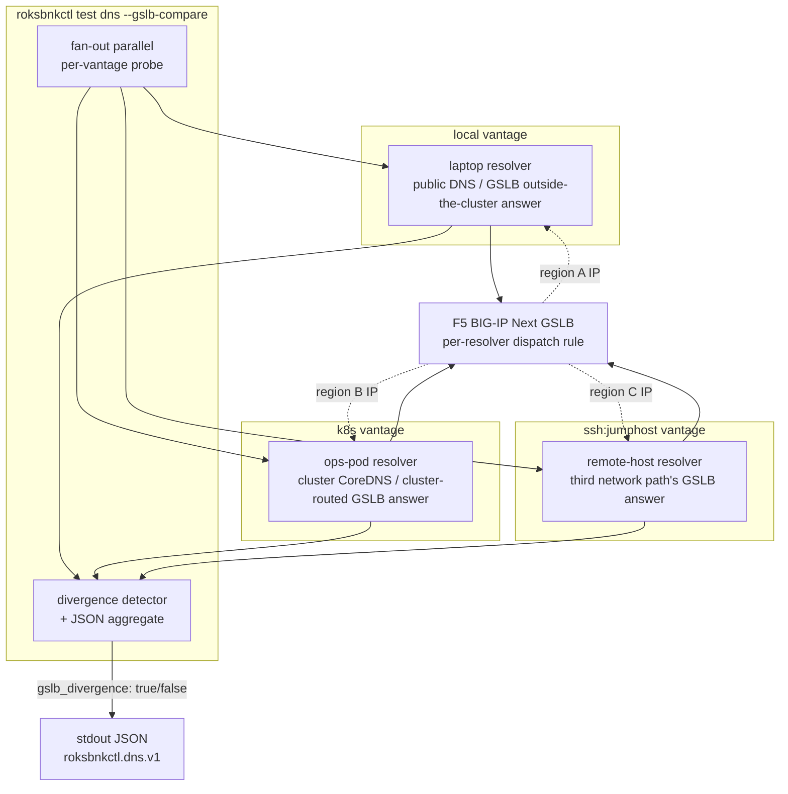

# DNS testing for GSLB

`roksbnkctl test dns` is the diagnostic surface for DNS-driven traffic management — the kind of behaviour an F5 BIG-IP Next GSLB deployment depends on, where the *answer* a name returns isn't a single global truth but a function of *who's asking from where*.

This is the longest chapter in the testing section because the question it answers is the most subtle. Connectivity testing tells you "the URL works"; throughput testing tells you "the path is fast". Both assume the name resolved. When the GSLB is the thing under test, "the name resolved" is *itself* the question — and the answer changes depending on the network vantage of whoever's asking.

The flag surface, the JSON output, and the multi-vantage workflow on this page are all what v1.0 ships. The design rationale lives in [PRD 03 §"DNS probe (GSLB-aware)"](https://github.com/jgruberf5/roksbnkctl/blob/main/docs/prd/03-EXECUTION-BACKENDS.md#dns-probe-gslb-aware); read that for the *why*, this chapter for the *how*.

## Three vantages, one comparison

`--gslb-compare` is the flagship workflow: a single `roksbnkctl test dns` invocation fans out across `local`, `k8s`, and (optionally) `ssh:<target>` vantages in parallel, asks each one to resolve the same name, and reports whether the answers diverged.



The point of the diagram: a single `roksbnkctl` invocation probes from network positions a `dig` from your laptop can't reach. The cluster vantage answers from the cluster's egress IP; the SSH vantage answers from a third network path. Comparing the three is exactly the assertion "is the GSLB rule taking effect" needs.

The design rationale for this shape lives in [PRD 03 §"DNS probe (GSLB-aware)"](https://github.com/jgruberf5/roksbnkctl/blob/main/docs/prd/03-EXECUTION-BACKENDS.md#dns-probe-gslb-aware). The rest of this chapter is the user-facing surface.

## The GSLB problem

F5 BIG-IP Next's GSLB (Global Server Load Balancing) returns different DNS answers depending on the requesting resolver's IP address. The discrimination is a feature, not a bug — that's the whole point of GSLB:

- **Geographic affinity**: a user in the US gets a US datacenter IP; a user in the EU gets an EU datacenter IP. The dispatch rule is per-region.
- **Datacenter routing**: a request from a known partner CIDR gets a private VIP; a request from the public internet gets a public VIP.
- **Health-check state**: when the primary pool member goes unhealthy, GSLB starts handing out the secondary pool member's IP — but only after the resolver's TTL on the prior answer expires.
- **Anycast vs unicast**: a name fronted by an anycast resolver fleet may return the same answer everywhere; the same name fronted by GSLB returns a per-region answer.

Validating GSLB means validating that the *right* answer comes back from the *right* vantage. From your laptop in Toronto, you should see the US datacenter IP. From a workload running in the EU, you should see the EU datacenter IP. From an east-Asia bastion, you should see whatever your GSLB rule says east-Asia gets.

The standard `dig www.example.com` from your laptop only ever tells you what your laptop's resolver, talking to its configured upstream, gets back. That's one vantage. To validate GSLB you need *several*, and you need to be able to compare the answers.

## Why per-vantage probing matters

A concrete worked example. Suppose your GSLB rule says:

> "Users in the US get the IP for `dc1.example.com` (`169.45.91.10`). Users in the EU get the IP for `dc2.example.com` (`52.123.45.67`)."

You run from your laptop in the US:

```bash
$ dig +short www.example.com
169.45.91.10
```

That confirms the US rule. But it tells you nothing about the EU rule. To verify the EU rule you'd have to actually be in the EU — or, more practically, run the query *from* a network vantage that the GSLB will treat as EU.

`roksbnkctl test dns` makes that vantage selection a flag:

```bash
# From the laptop (your home / office / coffee-shop IP)
roksbnkctl test dns --target www.example.com --type A --backend local

# From inside the cluster (the cluster's egress IP — often a different region)
roksbnkctl test dns --target www.example.com --type A --backend k8s

# From a registered SSH target in the EU
roksbnkctl test dns --target www.example.com --type A --backend ssh:eu-bastion
```

The `--gslb-compare` flag fans out across the configured backends in parallel and emits a single JSON report that calls out whether the answers diverged across vantages — exactly the assertion you need for "is the GSLB rule taking effect".

## The `roksbnkctl test dns` flag surface

```bash
roksbnkctl test dns \
  [--target <name>] \
  [--type <record-type>] \
  [--server <server-spec>] \
  [--iterations <N>] \
  [--backend <local|k8s|ssh:<target>>] \
  [--gslb-compare] \
  [-o json]
```

| Flag | Default | Notes |
|---|---|---|
| `--target` | the workspace's `test.dns.default_target` if set, otherwise required | The DNS name to query. FQDN preferred (the trailing dot is added if missing). |
| `--type` | `A` | Any record type the underlying [`miekg/dns`](https://github.com/miekg/dns) library accepts via [`dns.StringToType`](https://pkg.go.dev/github.com/miekg/dns#StringToType). Common picks: `A`, `AAAA`, `CNAME`, `MX`, `NS`, `TXT`, `SRV`, `SOA`, `PTR`, `CAA`, `DS`, `DNSKEY`, `ANY`. The full table also includes `HTTPS`, `SVCB`, `TLSA`, `SSHFP`, `URI`, `NAPTR`, `RRSIG`, `NSEC`/`NSEC3`, `LOC`, etc. |
| `--server` | `system` | Where to send the query. Literal IP, `host:port`, the keyword `system` (use the host's `/etc/resolv.conf`), the keyword `cluster` (use the cluster's CoreDNS — `--backend k8s` only), or a name from the workspace's `test.dns.resolvers` map. |
| `--iterations` | `1` | How many queries to send to the same server. The runner reports per-query RTT plus p50/p95/p99 across the run. |
| `--backend` | per-tool default (see [§ Backend selection](#backend-selection-for-the-probe)) | `local`, `k8s`, or `ssh:<target>`. Docker is rejected — see [§ Why `--backend docker` is rejected](#why---backend-docker-is-rejected). |
| `--gslb-compare` | off | Fan out across all configured vantages and emit a comparison JSON. See [§ The `--gslb-compare` workflow](#the---gslb-compare-workflow). |
| `-o json` | text | Switch from human-readable text on stderr to JSON on stdout. Two schemas: `roksbnkctl.dns.v1.vantage` for single-vantage runs (a flat document), `roksbnkctl.dns.v1` for `--gslb-compare` (wraps one or more vantages plus a `gslb_divergence` boolean). |

The probe library is `github.com/miekg/dns` — the same DNS implementation CoreDNS uses. Replacing the standard library's `net.Resolver` got us three things we couldn't get otherwise:

- **Full record-type surface**: `net.Resolver` only exposes a fixed subset; GSLB validation often needs `CAA` (cert provisioning), `DS`/`DNSKEY` (DNSSEC), or `SOA` (authority chain) which `net.Resolver` doesn't.
- **Per-query server selection**: standard library hides the upstream resolver behind whatever `/etc/resolv.conf` says; we need to be able to point at a specific GSLB VIP for the query.
- **Per-query RTT measurement**: `miekg/dns`'s `Exchange()` returns `time.Duration` directly. No timing-overhead fudging from running queries serially through the resolver chain.

When `--backend k8s` is selected, the probe self-execs as a one-shot Job in the `roksbnkctl-test` namespace — no separate image. `roksbnkctl` is its own probe runner; the Job's pod runs `roksbnkctl test dns ...` with `--backend local` from the cluster's network vantage. See [Chapter 17 §"K8s backend"](./17-execution-backends.md#k8s-backend) for the Job mechanics.

## Server resolution

`--server` accepts five forms:

### Literal IP or `host:port`

```bash
roksbnkctl test dns --target www.example.com --type A --server 8.8.8.8
roksbnkctl test dns --target www.example.com --type A --server 8.8.8.8:53
roksbnkctl test dns --target www.example.com --type A --server gslb-vip.example.com:53
```

Bare hosts default to port 53. IPv6 literals must be bracketed: `[2001:4860:4860::8888]:53`.

### `system`

```bash
roksbnkctl test dns --target www.example.com --type A --server system
```

Reads `/etc/resolv.conf` from the host running the probe (so for `--backend local` that's your laptop; for `--backend k8s` that's the Pod's `/etc/resolv.conf`, which CoreDNS owns; for `--backend ssh:<target>` that's the target's `/etc/resolv.conf`). This is the default if `--server` is omitted entirely.

### `cluster`

```bash
roksbnkctl test dns --target www.example.com --type A --server cluster --backend k8s
```

Identical to `system` when running with `--backend k8s` (CoreDNS is what the Pod's `/etc/resolv.conf` points at). Allowed only with `--backend k8s` — using `--server cluster` from a `local` or `ssh` vantage errors at parse time, since "cluster CoreDNS" isn't a meaningful concept from outside.

### Named resolver from workspace config

```bash
roksbnkctl test dns --target www.example.com --type A --server gslb-vip
```

Looks up `gslb-vip` in `test.dns.resolvers` (see next section). Useful for checking the same name against several different upstream resolvers without remembering each IP.

## Workspace config: `test.dns`

Two new keys land this sprint under the existing `test:` block:

```yaml
# ~/.roksbnkctl/<workspace>/config.yaml
test:
  dns:
    default_target: www.example.com
    resolvers:
      google:     "8.8.8.8:53"
      cloudflare: "1.1.1.1:53"
      gslb-vip:   "169.45.91.5:53"
```

| Field | Type | Default | Notes |
|---|---|---|---|
| `dns.default_target` | string | empty | The name `roksbnkctl test dns` queries when `--target` isn't passed. Lets you keep the per-workspace canonical name out of every CLI invocation. |
| `dns.resolvers` | map[string]string | empty | Named resolvers usable as `--server <name>`. Values are `<host>:<port>` (port required; mirrors the `--server` literal-IP form). |

Both are optional. With neither set, `--target` is required on every invocation and `--server` only accepts literal IPs / `system` / `cluster`.

[Chapter 12 §"test:"](./12-workspace-config.md#test) is the full workspace-config reference; this is the GSLB-relevant subset.

## Backend selection for the probe

The probe runs from one network vantage at a time per `--backend`:

- **`--backend local`**: in-process. Runs in the `roksbnkctl` binary itself, so the network vantage is your laptop's. No cluster prereq, no SSH prereq.
- **`--backend k8s`**: a one-shot Job in `roksbnkctl-test`. The Job's pod runs the bundled tools image `ghcr.io/jgruberf5/roksbnkctl-tools-ibmcloud:<tag>` — the same image the in-cluster ops pod uses, which carries both `ibmcloud` and `roksbnkctl` on PATH. (If a Job fails to pull, `kubectl describe pod` will name the `roksbnkctl-tools-ibmcloud` image — there is no separate `roksbnkctl-cli` image to look for.) The Job's command is `roksbnkctl test dns --target ... --type ... --server ... --backend local -o json`; the stdout is collected via the k8s backend's log-stream path. Vantage is the cluster's egress IP.
- **`--backend ssh:<target>`**: scps the `roksbnkctl` binary onto the target if it's missing (or skips if it's already there, marker-file gated), then runs the same `roksbnkctl test dns ... --backend local -o json` over SSH. The vantage is the target's IP.
- **`--backend docker`**: rejected — see below.

The default backend per `roksbnkctl` invocation (when `--backend` is omitted and there's no `exec.dns.backend` in workspace config) is `local`. To run GSLB cross-vantage you generally pass `--gslb-compare`, which fans out instead of picking a single vantage.

[Chapter 17 §"K8s backend"](./17-execution-backends.md#k8s-backend) has the one-shot-Job mechanics; [Chapter 17 §"SSH backend"](./17-execution-backends.md#ssh-backend) has the file-materialisation and bootstrap story. Both apply to the DNS probe verbatim.

## The `--gslb-compare` workflow

Pass `--gslb-compare` to fan out across all configured vantages in parallel and emit a single comparison JSON:

```bash
roksbnkctl test dns \
  --target www.example.com \
  --type A \
  --server gslb-vip.example.com \
  --gslb-compare \
  -o json
```

What happens:

1. The runner enumerates configured vantages: `local` always; `k8s` when a kubeconfig is reachable on the host (the probe runs as a one-shot Job in `roksbnkctl-test` — the long-lived ops pod isn't required); plus every entry in the workspace's `targets:` block, each as `ssh:<name>`.
2. Each vantage runs the probe in sequence (one at a time; the run completes when the slowest vantage returns). The query (target, type, server) is identical; only the backend differs. Worst-case wall time with three vantages and the default 2-second per-query timeout is ~6 seconds.
3. Per-vantage results are collected with their full RTT distribution and answer set.
4. The runner compares the answer sets across vantages. If they differ, `gslb_divergence` is set to `true` in the output and a human-readable summary names the diverging vantages.
5. The output is a single `roksbnkctl.dns.v1` JSON document wrapping one `vantages[]` entry per backend.

`gslb_divergence: true` is **not** a failure signal — for a healthy GSLB it's the *expected* outcome. The exit code is `0` whenever every per-vantage probe succeeded (got an answer, even if the answers differ). The exit code is `1` when any per-vantage probe failed (NXDOMAIN, SERVFAIL, timeout).

## JSON output schema

There are **two distinct JSON shapes** depending on whether `--gslb-compare` was passed. Both are versioned, both pin against [PRD 03 §"DNS probe"](https://github.com/jgruberf5/roksbnkctl/blob/main/docs/prd/03-EXECUTION-BACKENDS.md#dns-probe-gslb-aware), and both can be consumed by CI:

- **`roksbnkctl.dns.v1.vantage`** — single-vantage probe. A flat document describing one vantage's result.
- **`roksbnkctl.dns.v1`** — multi-vantage `--gslb-compare`. Wraps an array of per-vantage entries plus a `gslb_divergence` boolean.

### Single-vantage output (`roksbnkctl.dns.v1.vantage`)

```bash
roksbnkctl test dns --target www.cloudflare.com --type A --server 8.8.8.8 \
  --iterations 10 --backend local -o json
```

```json
{
  "schema": "roksbnkctl.dns.v1.vantage",
  "backend": "local",
  "server": "8.8.8.8:53",
  "iterations": 10,
  "rtt_ms": { "p50": 12.4, "p95": 18.1, "p99": 22.7 },
  "answers": [
    { "name": "www.cloudflare.com.", "type": "A", "ttl": 60, "rdata": "104.16.132.229" },
    { "name": "www.cloudflare.com.", "type": "A", "ttl": 60, "rdata": "104.16.133.229" }
  ],
  "rcode": "NOERROR",
  "authoritative": false,
  "truncated": false
}
```

This is the per-vantage shape — no `target` / `type` wrapper at the top level (the caller already knows what they queried), no `vantages[]` array, no `gslb_divergence` field.

### Multi-vantage output (`roksbnkctl.dns.v1`, divergence detected)

```bash
roksbnkctl test dns --target www.example.com --type A --server gslb-vip.example.com \
  --gslb-compare -o json
```

```json
{
  "schema": "roksbnkctl.dns.v1",
  "target": "www.example.com",
  "type": "A",
  "vantages": [
    {
      "schema": "roksbnkctl.dns.v1.vantage",
      "backend": "local",
      "server": "169.45.91.5:53",
      "iterations": 1,
      "rtt_ms": { "p50": 14.2, "p95": 14.2, "p99": 14.2 },
      "answers": [
        { "name": "www.example.com.", "type": "A", "ttl": 30, "rdata": "169.45.91.10" }
      ],
      "rcode": "NOERROR",
      "authoritative": true,
      "truncated": false
    },
    {
      "schema": "roksbnkctl.dns.v1.vantage",
      "backend": "k8s",
      "server": "169.45.91.5:53",
      "iterations": 1,
      "rtt_ms": { "p50": 8.7, "p95": 8.7, "p99": 8.7 },
      "answers": [
        { "name": "www.example.com.", "type": "A", "ttl": 30, "rdata": "10.20.30.40" }
      ],
      "rcode": "NOERROR",
      "authoritative": true,
      "truncated": false
    }
  ],
  "gslb_divergence": true,
  "gslb_divergence_summary": "answers differ between local (169.45.91.10) and k8s (10.20.30.40) — GSLB returning location-specific records as expected"
}
```

The comparison document embeds the per-vantage shape unchanged inside `vantages[]` — each entry still carries `"schema": "roksbnkctl.dns.v1.vantage"` so a downstream parser can validate per-vantage entries against the same schema independent of whether they came in standalone or as part of a comparison.

### Schema field reference

**Per-vantage shape** (`roksbnkctl.dns.v1.vantage`):

| Path | Type | Meaning |
|---|---|---|
| `schema` | string | Always `roksbnkctl.dns.v1.vantage`. |
| `backend` | string | `local`, `k8s`, or `ssh:<target>`. |
| `server` | string | The resolver address actually used (literal, system-resolvconf result, or named-resolver lookup). |
| `iterations` | int | How many queries went to that vantage. Mirrors `--iterations`. |
| `rtt_ms` | object | `{ p50, p95, p99 }` across the iterations. Single-iteration runs report the same number for all three. |
| `answers[]` | array | The RRs returned. `name` is the FQDN, `type` is the record type, `ttl` is from the response, `rdata` is the RR's data (IP for A/AAAA, target for CNAME, etc.). |
| `rcode` | string | The DNS response code: `NOERROR`, `NXDOMAIN`, `SERVFAIL`, `REFUSED`, `TIMEOUT`. |
| `authoritative` | bool | Whether the AA flag was set in the response. |
| `truncated` | bool | Whether the TC flag was set. (The probe automatically retries truncated UDP responses over TCP; the field reflects the final response.) |
| `error` | string | Present only when the probe could not get a usable response. Carries the underlying Go error string. |

**Comparison shape** (`roksbnkctl.dns.v1`, emitted by `--gslb-compare`):

| Path | Type | Meaning |
|---|---|---|
| `schema` | string | Always `roksbnkctl.dns.v1`. |
| `target` | string | The queried name, normalised to FQDN (trailing dot included). |
| `type` | string | The record type queried. |
| `vantages[]` | array | One per-vantage entry (each conforms to `roksbnkctl.dns.v1.vantage`). |
| `gslb_divergence` | bool | True when the answer sets across `vantages[]` differ. |
| `gslb_divergence_summary` | string | Present only when `gslb_divergence: true`. Human-readable explanation naming the diverging vantages and answers. |

Both schemas are stable at v1.0 — additive changes (new optional fields) are allowed within `v1`; field renames or removals would bump to `.v2`. v1.0 includes the optional `edns_client_subnet` object on each per-vantage entry, emitted when the resolver echoes an EDNS Client Subnet option (RFC 7871) in its response — most GSLB-aware authoritative servers do; vanilla recursive resolvers don't, in which case the field is omitted from the JSON via `omitempty`. Sub-fields are `family` (1 = IPv4, 2 = IPv6), `source_netmask`, `scope_netmask`, and `address`. Useful for confirming the GSLB actually saw your client's geographic scope rather than the resolver's IP.

## RTT measurement and `--iterations`

Per-query RTT is captured directly from `miekg/dns`'s `Exchange()`, which returns the round-trip duration without the runner having to wrap a stopwatch around the call. That keeps the timing honest — no scheduling jitter from a goroutine yield between `time.Now()` and the actual UDP send.

`--iterations N` runs the same query against the same server N times serially and reports p50/p95/p99 across the samples. Use cases:

- **Detecting health-check flapping**: if a GSLB pool member is on the edge of its health threshold, the answer can flip back and forth across iterations. A single query catches one snapshot; ten iterations show the ratio.
- **Detecting anycast routing changes**: when an anycast resolver changes which BGP path serves your AS, RTT can jump 30-100ms. p99 catches the worst case; p50 stays steady.
- **Establishing a baseline before a change**: run with `--iterations 30` before a GSLB rule change, again after, and compare distributions.

For `--backend k8s` and `--backend ssh:<target>`, RTT is measured **inside** the remote vantage. The number reflects the resolver-to-resolver path from that vantage, not the laptop-to-cluster (or laptop-to-jumphost) transit. That's the correct measurement: when you ask "how slow is the GSLB from inside the cluster", you mean cluster-side latency, not how long it took your laptop to wait for the SSH-tunnelled answer.

## Sample F5 BIG-IP Next GSLB scenarios

Three concrete scenarios you'll hit when validating a real BNK deployment.

### Scenario 1: Geographic affinity working as expected

You've configured a GSLB rule that returns `dc1` (`169.45.91.10`) for US queries and `dc2` (`52.123.45.67`) for EU queries. You're in the US, your jumphost is in `eu-de` (Frankfurt).

```bash
roksbnkctl test dns \
  --target www.example.com \
  --type A \
  --server gslb-vip.example.com \
  --gslb-compare \
  -o json
```

Expected output:

```json
{
  "schema": "roksbnkctl.dns.v1",
  "target": "www.example.com",
  "type": "A",
  "vantages": [
    { "backend": "local",            "answers": [{ "rdata": "169.45.91.10" }], "rcode": "NOERROR" },
    { "backend": "ssh:eu-jumphost",  "answers": [{ "rdata": "52.123.45.67" }], "rcode": "NOERROR" }
  ],
  "gslb_divergence": true,
  "gslb_divergence_summary": "answers differ between local (169.45.91.10) and ssh:eu-jumphost (52.123.45.67) — GSLB returning location-specific records as expected"
}
```

`gslb_divergence: true` is the assertion you wanted. There are two ways to key CI on it:

```bash
# Option A: parse the JSON yourself
roksbnkctl test dns ... --gslb-compare -o json | jq -e '.gslb_divergence == true'

# Option B: built-in --require-divergence flag (the binary returns
# non-zero exit when --gslb-compare finds NO divergence)
roksbnkctl test dns ... --gslb-compare --require-divergence
```

Both forms produce a non-zero exit when `gslb_divergence` is `false` — the `--require-divergence` flag is the same assertion baked into the binary so CI scripts don't need a `jq` dependency. Pick whichever fits your pipeline.

If `gslb_divergence` flips to `false`, something has changed — the GSLB rule was disabled, the geographic dispatch broke, or the jumphost moved out of the EU range. Surface that as a CI failure.

### Scenario 2: Health-check-driven failover

A BNK pool member backing `www.example.com` has an active health check. You want to verify that GSLB stops returning that member's IP when the health check fails.

Steps:

```bash
# 1. Baseline: while the member is healthy, both vantages return its IP
roksbnkctl test dns --target www.example.com --type A --server gslb-vip.example.com \
  --gslb-compare -o json > /tmp/before.json

# 2. Take the member offline (BNK admin UI / API; outside roksbnkctl's surface)
# 3. Wait for the GSLB's TTL to expire (in this example, 30 seconds)
sleep 35

# 4. Probe again
roksbnkctl test dns --target www.example.com --type A --server gslb-vip.example.com \
  --gslb-compare -o json > /tmp/after.json

# 5. Diff the answer sets
diff <(jq '.vantages[].answers' /tmp/before.json) <(jq '.vantages[].answers' /tmp/after.json)
```

You expect the IP in `vantages[].answers[].rdata` to change from the failed member's IP to the secondary's IP across both vantages — and to do so on roughly the same TTL boundary across vantages. If one vantage flips and the other doesn't, the GSLB's health-check propagation is asymmetric — useful diagnostic data.

### Scenario 3: Anycast vs unicast detection

You suspect a name is fronted by a public anycast resolver fleet (Cloudflare's `1.1.1.1`, Google's `8.8.8.8`) rather than a real GSLB. Anycast returns the same answer everywhere; GSLB returns per-region answers.

```bash
roksbnkctl test dns --target www.cloudflare.com --type A --server 8.8.8.8 \
  --gslb-compare -o json
```

```json
{
  "schema": "roksbnkctl.dns.v1",
  "target": "www.cloudflare.com",
  "vantages": [
    { "backend": "local", "answers": [{ "rdata": "104.16.132.229" }] },
    { "backend": "k8s",   "answers": [{ "rdata": "104.16.132.229" }] }
  ],
  "gslb_divergence": false
}
```

`gslb_divergence: false` despite probing from two vantages → the answer is anycast, not GSLB-dispatched. Useful when handing off to a customer who's claiming "the GSLB isn't routing me right" — you can prove the name they're querying isn't actually under GSLB control.

## Why `--backend docker` is rejected

A Docker container running locally on the user's laptop has the same network identity as the host (default bridge networking). The container's egress NATs out via the host's interface, so a DNS query from inside the container reaches the upstream resolver from the host's IP.

For GSLB validation, that means `--backend docker` would give an answer identical to `--backend local`. No new vantage. The CLI rejects the combination at parse time:

```
$ roksbnkctl test dns --backend docker --target www.example.com --type A
error: DNS probe doesn't benefit from --backend docker (same network identity
       as --backend local, no GSLB-relevant vantage difference). Use --backend
       local, --backend k8s, or --backend ssh:<target> instead.
```

This is by design and called out in [PRD 03 §"DNS probe"](https://github.com/jgruberf5/roksbnkctl/blob/main/docs/prd/03-EXECUTION-BACKENDS.md#dns-probe-gslb-aware). If you want frozen-toolchain DNS testing for CI reproducibility, the `roksbnkctl` binary itself is already a single static binary — pinning it to a specific version pins the probe.

## Integration with `extra_hosts`

If you've configured `connectivity.extra_hosts` for your workspace and want a quick "does each of those names resolve" check:

```bash
roksbnkctl test dns
```

With no `--target` and no `--gslb-compare`, the runner falls back to today's behaviour: probe each host in `connectivity.extra_hosts`, single-vantage, single-iteration, with the host's `system` resolver. This is the same shape as the connectivity suite's reachability probe — no GSLB awareness, no per-server selection — and is the right tool for "did I typo a hostname in my config" rather than "is the GSLB doing what I configured".

For real GSLB validation you almost always want `--gslb-compare` plus an explicit `--target` and `--server`. The `extra_hosts` fallback is the carry-over from earlier roksbnkctl releases, kept for compatibility.

[Chapter 20 — Connectivity testing](./20-connectivity-testing.md) covers `connectivity.extra_hosts` in full.

## Worked example: GSLB divergence troubleshooting

End-to-end Part VI scenario: a customer's BNK GSLB rule says "users in the US get IP A, users in the EU get IP B". They claim the rule isn't working — EU users keep landing on the US datacenter. You have `roksbnkctl` configured with a local laptop (your office), the customer's cluster (ops pod installed), and a customer-provided EU bastion as an SSH target named `eu-bastion`. Goal: prove or disprove the divergence, point at where to look next.

```bash
# 1. Baseline — three-vantage probe of the GSLB-fronted name
$ roksbnkctl test dns \
    --target www.example.com \
    --type A \
    --server gslb-vip.example.com \
    --gslb-compare \
    -o json | tee /tmp/gslb-baseline.json | jq .
{
  "schema": "roksbnkctl.dns.v1",
  "target": "www.example.com",
  "type": "A",
  "server": "gslb-vip.example.com",
  "gslb_divergence": false,
  "vantages": [
    {
      "backend": "local",
      "answers": [{"rdata": "192.0.2.10"}],
      "rtt_ms": {"p50": 18.2, "p95": 22.1}
    },
    {
      "backend": "k8s",
      "answers": [{"rdata": "192.0.2.10"}],
      "rtt_ms": {"p50": 6.4, "p95": 9.8}
    },
    {
      "backend": "ssh:eu-bastion",
      "answers": [{"rdata": "192.0.2.10"}],
      "rtt_ms": {"p50": 24.7, "p95": 31.4}
    }
  ]
}

# Note: `gslb_divergence: false` means ALL THREE vantages got 192.0.2.10
# back. That's the smoking gun — the customer is right. The GSLB is
# returning the same answer regardless of where the resolver is.

# 2. Confirm via `dig` from the EU bastion directly (sanity check that
# roksbnkctl isn't somehow masking the answer)
$ roksbnkctl exec --on eu-bastion -- dig +short @gslb-vip.example.com www.example.com
192.0.2.10
# Same answer. The probe isn't lying.

# 3. Check the GSLB rule's resolver-IP detection
$ roksbnkctl ibmcloud --backend ssh:eu-bastion ks cluster get \
    --cluster customer-cluster --json | jq '.serviceEndpoints'
# (Inspect the cluster's egress IP that GSLB sees for k8s vantage queries)

# 4. Repeat the probe with a known-good test name (one with a working
# anycast resolver, to rule out probe-side bugs)
$ roksbnkctl test dns \
    --target www.cloudflare.com \
    --type A \
    --server 8.8.8.8 \
    --gslb-compare
✓ local         : 104.16.124.96 (RTT 12ms)
✓ k8s           : 104.16.124.96 (RTT 6ms)
✓ ssh:eu-bastion: 104.16.124.96 (RTT 28ms)
  gslb_divergence: false  (anycast — expected)

# 5. Hand off the artefact to the GSLB owner with three pieces of evidence:
#    - /tmp/gslb-baseline.json (the divergence-false JSON)
#    - The cluster's resolver-IP-as-seen-by-GSLB from step 3
#    - Confirmation that the probe machinery itself works (step 4)
```

What this walkthrough lets you say with confidence: "the GSLB is returning 192.0.2.10 to all three vantages including the EU bastion. The rule isn't dispatching. Check the rule's resolver-IP-CIDR-match clause against the EU bastion's egress IP `<X>`." That's a falsifiable claim a GSLB engineer can act on.

Common follow-up failure modes (covered in [Chapter 26](./26-troubleshooting.md)):

- **Probe says diverged but customer says it's not** — likely the customer's testing point is behind a NAT that masks their network position; their resolver looks like a different region to the GSLB.
- **Probe says NOT diverged but customer says it IS** — likely the customer is querying through a CDN-fronted resolver that anycasts the request. Re-probe with `--server <gslb-vip-directly>` to skip the resolver chain.
- **All vantages return SERVFAIL** — the GSLB-VIP isn't reachable from any of them. Check connectivity ([Chapter 20](./20-connectivity-testing.md)) before re-running.

## Cross-references

- [PRD 03 §"DNS probe (GSLB-aware)"](https://github.com/jgruberf5/roksbnkctl/blob/main/docs/prd/03-EXECUTION-BACKENDS.md#dns-probe-gslb-aware) — design rationale, the full schema spec, the rejected-by-design list.
- [PRD 05 §"Phase L-DNS"](https://github.com/jgruberf5/roksbnkctl/blob/main/docs/prd/05-E2E-TEST-PLAN.md#phase-l-dns--dns-probe-gslb-aware-across-backends) — the end-to-end test sequence that validates each row of this chapter against a live cluster.
- [Chapter 12 §"test:"](./12-workspace-config.md#test) — workspace-config schema, including `test.dns.resolvers` and `test.dns.default_target`.
- [Chapter 14 — Credentials and the resolver chain](./14-credentials-resolver.md) — how `roksbnkctl` itself reaches the cluster / SSH target the probe runs on.
- [Chapter 17 §"K8s backend"](./17-execution-backends.md#k8s-backend) — the one-shot-Job mechanics the probe reuses for `--backend k8s`.
- [Chapter 17 §"SSH backend"](./17-execution-backends.md#ssh-backend) — file materialisation and bootstrap for `--backend ssh:<target>`.
- [Chapter 18 §"I'm doing GSLB DNS validation"](./18-choosing-backend.md#im-doing-gslb-dns-validation) — the decision-tree row that picks backends for a GSLB scenario.
- [Chapter 20 — Connectivity testing](./20-connectivity-testing.md) — the simpler "does HTTP work" companion suite.
- [Chapter 22 — Throughput testing](./22-throughput-testing.md) — the bandwidth-measurement companion suite.
- [`miekg/dns` upstream](https://github.com/miekg/dns) — the underlying DNS library, used by CoreDNS and a long list of other reference implementations.
