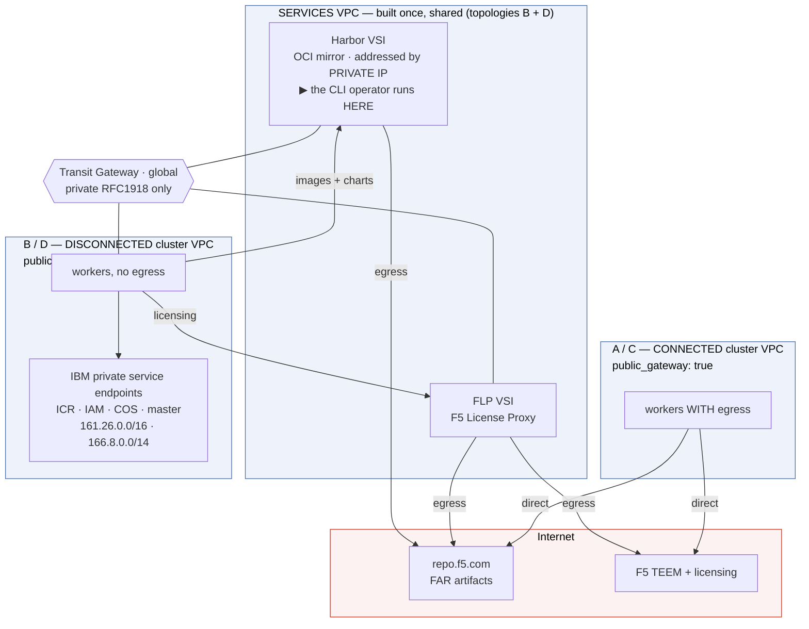
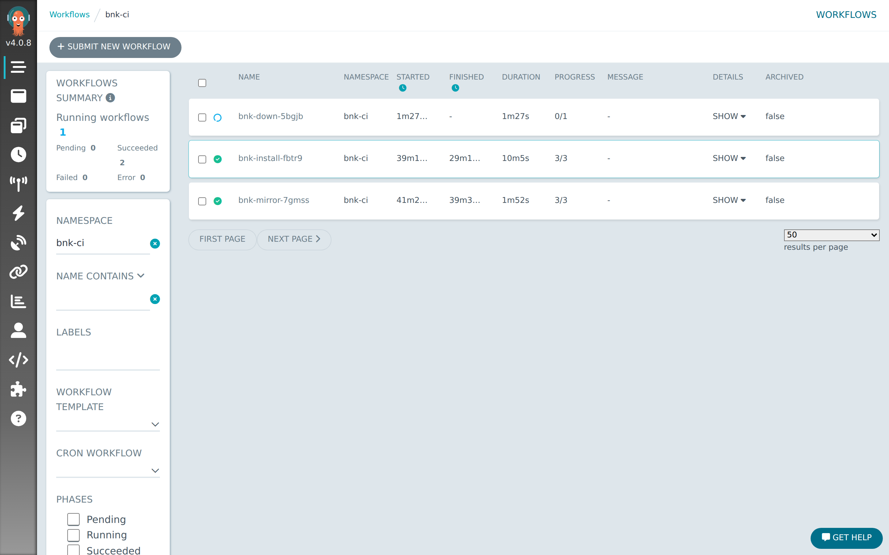
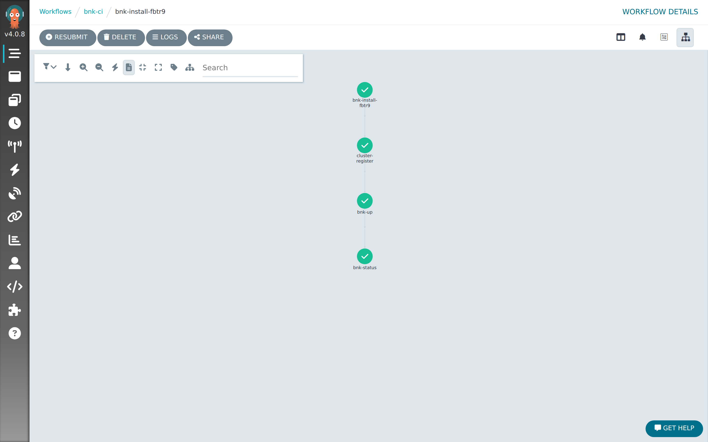

# Appendix A — The four cluster topologies, end to end

BNK on ROKS comes in **four shapes**, and every one of them is the same roksbnkctl pipeline with
different answers to two questions:

1. **Does roksbnkctl build the cluster, or adopt one that already exists?**
2. **Do the workers have Internet egress, or not?**

That is the whole taxonomy. This appendix walks all four end to end, twice: once driven
**by hand from the CLI**, once driven **as a CI pipeline by Argo Workflows** — the same binary,
the same commands, the same workspace layout, only the thing typing them changes.

| # | Topology | Cluster | Worker egress | Artifacts from | Licensing | Transit Gateway |
|---|---|---|---|---|---|---|
| **A** | New + connected | roksbnkctl creates it | **yes** (public gateway) | `repo.f5.com` directly | F5 directly | roksbnkctl creates its own |
| **B** | New + disconnected | roksbnkctl creates it | **no** | private mirror (Harbor) | F5 License Proxy | **joins an existing shared one** |
| **C** | Existing + connected | you already have it | **yes** | `repo.f5.com` directly | F5 directly | already attached |
| **D** | Existing + disconnected | you already have it | **no** | private mirror (Harbor) | F5 License Proxy | already attached |

**A and C need nothing else.** They reach F5 over the Internet, so there is no mirror to fill and
no proxy to build. If that is your case, skip straight to [1A](#1a-new-vpc-connected-cluster-cli)
or [1C](#1c-existing-connected-cluster-cli) — Part 0 does not apply to you.

**B and D need the services infrastructure first** — a Harbor registry holding a mirror of F5's
artifacts, and a standalone F5 License Proxy, both reachable from the cluster over a Transit
Gateway. That is [Part 0](#part-0-the-services-infrastructure-topologies-b-and-d-only), and it is
built **once** and shared by every disconnected cluster afterwards.

Related chapters: [Air-gapped install](./10a-air-gapped-install.md),
[The F5 License Proxy](./10c-flp-licensing.md),
[Sharing a Transit Gateway](./09a-transit-gateway-sharing.md),
[Registering an existing cluster](./09-registering-existing-cluster.md).

## The topology — what reaches the Internet, and what doesn't



**Reachability summary**

| Component | Internet? | How it reaches what it needs |
|---|---|---|
| **Harbor VSI** (B, D) | **Yes** — FAR pull only | public gateway (services VPC) |
| **FLP VSI** (B, D) | **Yes** — F5 licensing + TEEM only | public gateway (services VPC) |
| **Connected** workers (A, C) | **Yes** | their own public gateway |
| **Disconnected** workers (B, D) → Harbor / FLP | **No** | private IPs over the Transit Gateway |
| Any workers → ICR / IAM / COS / master | **No** | IBM private service-endpoint CIDRs (`161.26.0.0/16`, `166.8.0.0/14`) — routable without a public gateway |
| Operator (`roksbnkctl`, CLI) | on the Harbor VSI for B/D; anywhere with egress for A/C | — |

> **Why no operator-built VPEs are needed for the platform.** A `public_gateway: false` ROKS
> VPC cluster still reaches its IBM Cloud dependencies privately: system-image pulls use
> **private ICR** (`private.icr.io`), IAM/COS use their **private endpoints**, and the
> **master** is reached over the **private service endpoint ROKS provisions itself**. All of
> those resolve into IBM Cloud's service-endpoint ranges (`161.26.0.0/16`, `166.8.0.0/14`),
> which the VPC routes **without a public gateway**. Calico SNATs pod egress to the node, and
> the node uses those implicit routes. So the platform works private-only out of the box; you
> only add explicit **VPEs** for a *specific* service instance you want on a dedicated private
> endpoint (e.g. a particular COS bucket), not for the core ICR/IAM/COS/master path.

> **roksbnkctl does not build the services VPC, Harbor, or the FLP host image.** It provisions
> no registries and no standalone VPCs (VPC creation only happens inside the cluster phase).
> Part 0 uses the `ibmcloud` CLI for those prerequisites; everything after it is `roksbnkctl`.

## Prerequisites

**All four topologies:**

- An IBM Cloud API key with VPC, Kubernetes Service and Transit Gateway authority.
- `terraform >= 1.10` on `PATH` (the floor is enforced — see [Chapter 12a](./12a-remote-state.md)),
  plus `roksbnkctl` and `kubectl`. `roksbnkctl doctor` should be healthy.
- The **FAR supply chain**: `f5-far-auth-key.tgz` and `subscription.jwt`, either staged as files
  or — better for CI — uploaded once into a COS bucket (see the box in
  [S2](#s2-mirror-far-harbor)).

**Additionally for B and D (disconnected):**

- An **existing global Transit Gateway** (a *global* gateway spans regions; a local one does not).
- An **RSA** VPC SSH key (IBM Cloud VPC rejects ed25519).
- The `ibmcloud` CLI with the `vpc-infrastructure` and `tg-cli` plugins, plus `jq`, to build the
  services VPC in Part 0.

### Versions this appendix was tested against

| Component | Tested | Floor, and why |
|---|---|---|
| `roksbnkctl` / `roksbnkctl-tools-runner` | **v1.40.2** | **≥ v1.36.0** for `registry adopt` (B and D cannot work without it); **≥ v1.37.0** for `bnkforge unregister`; **≥ v1.39.0** for `cluster.vpc_cidr`; **≥ v1.40.1** fixes a variable validation that raised `Invalid index` on *every* terraform 1.10 plan. |
| terraform | **1.10.5** (shipped inside the runner) | **≥ 1.10**, enforced. Do not assume newer behaviour — 1.10 and 1.15 differ in ways that have shipped bugs here. |
| OpenShift (ROKS) | **4.20** (recommended default) | `cluster.openshift_version: "4.20"` pins the minor; the latest patch within it is selected automatically. The end-to-end run recorded here was on **4.18.51** — the pipeline is version-agnostic, but that is the build the timings and screenshots come from. Check `ibmcloud ks versions` for what your account offers; IBM's own default moves ahead of this. |
| Argo Workflows (Part 2) | **v4.0.8** | ≥ v3.4 for the emissary executor and `sidecars:`. |
| Kubernetes hosting Argo (Part 2) | **k3s v1.36.3+k3s1** | any conformant cluster with an RWO StorageClass. |

## Addressing — give every VPC its own block

Read this before creating anything, because it cannot be changed afterwards.

A Transit Gateway routes on **VPC address prefixes**. Two attached VPCs claiming the same block
make the route ambiguous, and the gateway resolves that by silently blackholing one of them —
no error, no log line. It surfaces later as *intermittent* image-pull timeouts against the mirror
while every security group and ACL in the path plainly allows the traffic.

It is easy to hit by accident: IBM's default address-prefix management is `auto`, which gives
**every** VPC in a region the identical three per-zone prefixes
(`10.241.0.0/18`, `10.241.64.0/18`, `10.241.128.0/18`). So a second disconnected cluster on a
shared gateway collides **by construction**.

Set `cluster.vpc_cidr` (env `ROKSBNKCTL_CLUSTER_VPC_CIDR`) per cluster. A worked allocation:

| VPC | Block | Per-zone prefixes |
|---|---|---|
| services (Harbor + FLP) | *existing, `auto`* | `10.241.0.0/18`, `.64.0/18`, `.128.0/18` |
| first disconnected cluster | `10.242.0.0/16` | `10.242.0.0/18`, `.64.0/18`, `.128.0/18` |
| second disconnected cluster | `10.243.0.0/16` | `10.243.0.0/18`, `.64.0/18`, `.128.0/18` |

The block is split three ways, so **`/18` is the smallest usable value**. Leaving it blank keeps
`auto`, which is fine for exactly one cluster per gateway. Since `v1.39.0` both `cluster up` and
`tgw connect` refuse a detectable overlap up front and name the conflicting VPC — but only a
distinct block prevents it. Full write-up: [Chapter 9a](./09a-transit-gateway-sharing.md#first-give-each-cluster-vpc-its-own-address-block).

Topology **A** creates its *own* gateway and is its only member, so the default is safe there.

## Part 0 — The services infrastructure (topologies B and D only)

Built **once** with the `ibmcloud` CLI, then shared by every disconnected cluster. If you only
ever run connected clusters, skip this entire part.

```bash
export IBMCLOUD_API_KEY=…
export TGW_NAME=my-global-tgw
export SVC_REGION=us-east SVC_ZONE=us-east-1
export SVC_PREFIX=bnk-svc RESOURCE_GROUP=default
export SSH_KEY_NAME=bnk-rsa-key                 # an RSA key already in IBM Cloud VPC
export HARBOR_ADMIN_PASSWORD=…                  # you choose it; it is a credential
ibmcloud login --apikey "$IBMCLOUD_API_KEY" -r "$SVC_REGION" -g "$RESOURCE_GROUP" -q
TGW_ID=$(ibmcloud tg gateways --output json | jq -r --arg n "$TGW_NAME" '.[]|select(.name==$n)|.id')
```

### S1 — Services VPC + Harbor, attached to the TGW

```bash
# VPC + subnet + public gateway (the only egress) + 22/443 inbound
SVC_VPC_ID=$(ibmcloud is vpc-create "${SVC_PREFIX}-vpc" --resource-group-name "$RESOURCE_GROUP" --output json | jq -r .id)
SVC_VPC_CRN=$(ibmcloud is vpc "$SVC_VPC_ID" --output json | jq -r .crn)
SUBNET_ID=$(ibmcloud is subnet-create "${SVC_PREFIX}-subnet" "$SVC_VPC_ID" --zone "$SVC_ZONE" \
              --ipv4-address-count 256 --resource-group-name "$RESOURCE_GROUP" --output json | jq -r .id)
PGW_ID=$(ibmcloud is public-gateway-create "${SVC_PREFIX}-pgw" "$SVC_VPC_ID" "$SVC_ZONE" --output json | jq -r .id)
ibmcloud is subnet-update "$SUBNET_ID" --pgw "$PGW_ID"
SG=$(ibmcloud is vpc "$SVC_VPC_ID" --output json | jq -r .default_security_group.id)
for p in 22 443; do ibmcloud is security-group-rule-add "$SG" inbound tcp --port-min $p --port-max $p; done

# Attach to the gateway — the ONLY path from cluster workers to Harbor.
CONN_ID=$(ibmcloud tg connection-create "$TGW_ID" --name "${SVC_PREFIX}-conn" \
            --network-type vpc --network-id "$SVC_VPC_CRN" --output json | jq -r .id)
until [ "$(ibmcloud tg connection "$TGW_ID" "$CONN_ID" --output json | jq -r .status)" = attached ]; do sleep 6; done
```

> **Verify `attached` before moving on.** If this connection silently fails, nothing complains
> until `bnk up` dies ~10 minutes in with `cert_manager: context deadline exceeded` — the nodes
> could not reach the mirror, and only nodes with a cached image survived.

Harbor's TLS certificate must carry the **floating IP in its SAN**, so reserve the IP *before*
rendering cloud-init:

```bash
ibmcloud is floating-ip-reserve "${SVC_PREFIX}-harbor-fip" --zone "$SVC_ZONE"
HARBOR_FIP=$(ibmcloud is floating-ips --output json | jq -r --arg n "${SVC_PREFIX}-harbor-fip" '.[]|select(.name==$n)|.address')
HARBOR_FIP_ID=$(ibmcloud is floating-ips --output json | jq -r --arg n "${SVC_PREFIX}-harbor-fip" '.[]|select(.name==$n)|.id')

export HARBOR_FIP HARBOR_ADMIN_PASSWORD HARBOR_VERSION=v2.11.1
envsubst '${HARBOR_FIP} ${HARBOR_VERSION} ${HARBOR_ADMIN_PASSWORD}' \
  < scripts/demos/disconnected-cluster-cli-demo/harbor-cloud-init.yaml.tmpl > /tmp/harbor.yaml

VSI=$(ibmcloud is instance-create "${SVC_PREFIX}-harbor" "$SVC_VPC_ID" "$SVC_ZONE" bx2-4x16 "$SUBNET_ID" \
        --image ibm-ubuntu-22-04-5-minimal-amd64-17 --keys "$SSH_KEY_NAME" \
        --resource-group-name "$RESOURCE_GROUP" --user-data @/tmp/harbor.yaml --output json)
HARBOR_VSI_ID=$(echo "$VSI" | jq -r .id)
VNI=$(echo "$VSI" | jq -r '.primary_network_attachment.virtual_network_interface.id')
ibmcloud is virtual-network-interface-floating-ip-add "$VNI" "$HARBOR_FIP_ID"

# The primary IP is 0.0.0.0 at create time — poll until it binds, or you bake 0.0.0.0
# into generic_host and every mirrored image resolves to https://0.0.0.0/…
until HARBOR_PRIVATE_IP=$(ibmcloud is instance "$HARBOR_VSI_ID" --output json \
        | jq -r '.primary_network_interface.primary_ip.address') \
      && [ -n "$HARBOR_PRIVATE_IP" ] && [ "$HARBOR_PRIVATE_IP" != 0.0.0.0 ]; do sleep 5; done
echo "Harbor private=$HARBOR_PRIVATE_IP floating=$HARBOR_FIP"
```

Give cloud-init 8–15 minutes, then create the projects:

```bash
until curl -sk --max-time 8 "https://${HARBOR_FIP}/api/v2.0/systeminfo" | grep -q harbor_version; do sleep 30; done
for pj in bnk-mirror bnk-status; do
  curl -sk -u "admin:${HARBOR_ADMIN_PASSWORD}" -X POST "https://${HARBOR_FIP}/api/v2.0/projects" \
       -H 'Content-Type: application/json' -d "{\"project_name\":\"$pj\",\"public\":true}"
done
```

> **`bnk-mirror` is public (anonymous pull).** Harbor is network-isolated behind the gateway, so
> the network is the security boundary. Anonymous pull avoids a per-namespace pull-secret /
> ServiceAccount ordering race that can leave fresh cert-manager pods in `ImagePullBackOff`.

Finally, take the CA **from the file that generated it** — roksbnkctl refuses to adopt a
self-signed CA it merely discovered over the wire:

```bash
ssh -i <key> ubuntu@"$HARBOR_FIP" 'sudo cat /opt/harbor/certs/harbor.crt' > harbor-ca.crt
HARBOR_CA_B64=$(base64 -w0 < harbor-ca.crt)
```

### Put the operator on the VSI

For the CLI path, the Harbor VSI is the natural operator host: it is the only box with *both*
Internet egress (to pull FAR) *and* private reach to Harbor. `scp` `roksbnkctl` and the two FAR
artifacts across, or skip the staging entirely by using the COS supply chain below.

### S2 — Mirror FAR → Harbor

`registry replicate` pulls from `repo.f5.com` (the VSI's egress) and pushes to Harbor at its
**private IP**.

```yaml
# mirror.yaml  (on the VSI)
ibmcloud: { region: us-east, resource_group: default }
prefix: mirror
tf_source: { type: embedded }
cluster: { create: false, name: none }
bnk:
  manifest_version: 2.3.0-3.2598.3-0.0.170
  far_auth_local_file: /root/f5-far-auth-key.tgz
  subscription_jwt_local_file: /root/subscription.jwt
registry:
  target: generic                            # ← see the warning below
  generic_host: <HARBOR_PRIVATE_IP>          # local to the VSI, private to the cluster
  generic_repo_prefix: bnk-mirror
  generic_username: admin
  generic_password_b64: <base64 of the Harbor admin password>
  generic_ca_b64: <HARBOR_CA_B64>            # from the file, not the wire
```

```console
$ roksbnkctl -w mirror init --config-file mirror.yaml
$ roksbnkctl -w mirror registry bom          # the bill of materials to mirror
$ roksbnkctl -w mirror registry replicate    # FAR → Harbor (89 artifacts)
$ roksbnkctl -w mirror registry verify
```

> **`registry.target: generic` is not optional, and a `--target` flag is not a substitute.**
> `registry adopt` — which topologies B and D run — has **no `--target` flag**; it reads
> `registry.target` from the workspace config. Left unset it defaults to `icr`, `bnk up` renders
> `us.icr.io/<prefix>/…`, and every pull on an air-gapped cluster fails with
> `unauthorized: Authorization required`. Passing `--target generic` to `replicate` fills Harbor
> correctly but writes nothing the later `adopt` reads, so the two silently disagree.


> **Local files vs. the COS supply chain.** The config above points
> `bnk.far_auth_local_file` / `bnk.subscription_jwt_local_file` at files **on the operator VSI** —
> simplest when driving by hand. The alternative is to upload both **once** into a COS bucket and
> read them from there. **This is mandatory for CI**, where a container has no local files:
>
> ```bash
> roksbnkctl cos object put bnk-artifacts-<acct>/f5-far-auth-key.tgz ./f5-far-auth-key.tgz --instance bnk-supply-chain
> roksbnkctl cos object put bnk-artifacts-<acct>/subscription.jwt    ./subscription.jwt    --instance bnk-supply-chain
> ```
>
> then drop the two `*_local_file` keys and add:
>
> ```yaml
> cos: { instance: bnk-supply-chain, bucket: bnk-artifacts-<acct>, region: us-south }
> bnk:
>   far_auth_file: f5-far-auth-key.tgz       # object keys in the bucket above
>   subscription_jwt_file: subscription.jwt
> ```
>
> **The commands do not change** — only the config keys. See
> [Chapter 25 — the COS supply chain](./25-cos-supply-chain.md).

### S3 — Standalone FLP licensing appliance

The FLP is a **self-contained F5 licensing appliance** — a VSI running the `f5-license-proxy`
stack as a podman pod, with **no cluster**. It is the one box with controlled egress to F5: it
pulls its own images from `repo.f5.com` and brokers licences (and sends TEEM telemetry) on the
cluster's behalf, over a **private** IP the disconnected cluster reaches via the gateway.

```yaml
# flp.yaml  (on the VSI)
ibmcloud: { region: us-east, resource_group: default }
prefix: flp
tf_source: { type: embedded }
cluster: { create: false, name: none }
bnk:
  manifest_version: 2.3.0-3.2598.3-0.0.170
  far_auth_local_file: /root/f5-far-auth-key.tgz
  subscription_jwt_local_file: /root/subscription.jwt
flp:
  mode: vsi                       # mode:vsi + a non-empty vpc selects the cluster-less path
  vsi:
    vpc: <SVC_VPC_ID>
    zone: us-east-1
    profile: bx2-4x16
    ssh_key: <SSH_KEY_NAME>
    reach: private
    floating_ip: true             # operator address for `flp status` and the :80 UI
```

```console
$ roksbnkctl -w flp flp init --config-file flp.yaml
$ roksbnkctl -w flp flp up --auto      # builds the VSI + the licence-proxy pod
$ roksbnkctl -w flp flp output         # → flp_external_endpoint + root CA
```

Keep both outputs — every disconnected cluster needs them as `bnk.flp.external.url` and
`bnk.flp.external.root_ca_b64`.

> **The root CA is already base64. Pass it verbatim.** Re-encoding it hands the CWC a corrupt CA
> and licensing fails in a way that looks like a network problem.

#### The status web UI (optional)

`flp status` queries a small status service on port 80 of the FLP. It is an **optional add-on**:
it only exists if you built and pushed its image and set `flp.vsi.status_image`. The licence proxy
works perfectly without it — do not let its absence fail a pipeline.


## Part 1 — Driving it from the CLI

Four topologies, four subsections. Each is a complete config plus the commands, and each one is
**one roksbnkctl workspace** (`-w <name>`) — a workspace's terraform state describes exactly one
cluster, so never point two clusters at the same one.

### 1A — New VPC + connected cluster (CLI)

The simplest shape, and the one to read first. Workers have egress, so BNK pulls charts and
images straight from `repo.f5.com` and licenses directly against F5. **Nothing is mirrored and
nothing is proxied** — there is no `registry:` block and no `flp:` block, and their absence is
what makes it connected.

```yaml
# connected.yaml
ibmcloud: { region: us-east, resource_group: default }
prefix: bnk-conn
tf_source: { type: embedded }
cluster:
  create: true
  name: bnk-conn                  # a NEW cluster is named from the prefix; see the note below
  openshift_version: "4.20"
  workers_per_zone: 1
  public_gateway: true            # ← CONNECTED: worker Internet egress
resources:
  transit_gateway:   { create: true }    # its own gateway; it is the only member
  registry_cos:      { create: true }    # REQUIRED when creating — see the warning
  cert_manager:      { create: true }
  bnk:               { create: true }
  tgw_jumphost:      { create: false }
  cluster_jumphosts: { create: false }
  client_vpc:        { create: false }
bnk:
  manifest_version: 2.3.0-3.2598.3-0.0.170
  far_auth_local_file: /root/f5-far-auth-key.tgz
  subscription_jwt_local_file: /root/subscription.jwt
  # license_mode defaults to `connected` — F5 directly
```

```console
$ roksbnkctl -w bnkconn init --config-file connected.yaml
$ roksbnkctl -w bnkconn cluster up --auto     # ~45–55 min
$ roksbnkctl -w bnkconn bnk up --auto         # ~10 min
$ roksbnkctl -w bnkconn bnk status
```

> **⚠ `registry_cos: { create: true }` is mandatory when *creating* a cluster.** ROKS-on-VPC
> refuses to provision without a COS instance backing its **internal** image registry (`E7278`).
> That is IBM Cloud COS over the private service-endpoint range — needed even air-gapped.
> `create: false` fails the cluster create outright.

> **A new cluster is named from `prefix`, not from `cluster.name`.** `cluster.name` only selects
> which cluster to *adopt* (1C/1D). If you set a prefix of `bnk-conn`, the cluster comes up as
> `bnk-conn` — and that is the name 1C must later register.

### 1B — New VPC + disconnected cluster (CLI)

Requires [Part 0](#part-0-the-services-infrastructure-topologies-b-and-d-only). Three things make
it disconnected, and all three are visible in the config: `public_gateway: false`, a `registry:`
block pointing at Harbor, and `license_mode: f5licenseproxy` with the FLP endpoint.

It also **joins an existing gateway rather than creating one** — a new gateway of its own would
isolate it from the very mirror it exists to install from.

```yaml
# disconnected.yaml   (on the Harbor VSI)
ibmcloud: { region: us-south, resource_group: default }
prefix: bnk-disco
tf_source: { type: embedded }
cluster:
  create: true
  name: bnk-disco
  openshift_version: "4.20"
  workers_per_zone: 1
  public_gateway: false           # ← DISCONNECTED: no worker egress
  vpc_cidr: 10.242.0.0/16         # ← its own block; see "Addressing" above
resources:
  transit_gateway:   { create: false, existing: my-global-tgw }   # JOIN the mirror's gateway
  registry_cos:      { create: true }
  cert_manager:      { create: true }
  bnk:               { create: true }
  tgw_jumphost:      { create: false }
  cluster_jumphosts: { create: false }
  client_vpc:        { create: false }
registry:
  target: generic
  generic_host: <HARBOR_PRIVATE_IP>       # reached over the TGW
  generic_repo_prefix: bnk-mirror
  generic_username: admin
  generic_password_b64: <base64 of the Harbor admin password>
  generic_ca_b64: <HARBOR_CA_B64>
bnk:
  manifest_version: 2.3.0-3.2598.3-0.0.170
  far_auth_local_file: /root/f5-far-auth-key.tgz
  subscription_jwt_local_file: /root/subscription.jwt
  license_mode: f5licenseproxy
  flp:
    external:
      url: <flp_external_endpoint from S3>
      root_ca_b64: <flp_root_ca from S3>     # already base64 — verbatim
```

```console
$ roksbnkctl -w bnkdisco init --config-file disconnected.yaml
$ roksbnkctl -w bnkdisco cluster up --auto     # ~45–55 min; TGW connect runs at the end
$ roksbnkctl -w bnkdisco tgw status
$ roksbnkctl -w bnkdisco registry adopt        # ← record the mirror in THIS workspace
$ roksbnkctl -w bnkdisco bnk up --auto
$ roksbnkctl -w bnkdisco bnk status
```

> **`registry adopt` is the step people miss.** `bnk up` refuses to render against a mirror this
> workspace has no record of — otherwise BNK would be pointed at `far_repo_url`, which an
> air-gapped cluster cannot reach. Only `registry replicate` writes that record, and replicating
> again would need the FAR source this cluster has no route to. `adopt` writes the record from
> the registry config alone, with no source access. That is the entire reason it exists.
>
> If you mirrored in a *different* workspace on the same host (S2 used `-w mirror`), copying the
> record works too: `cp ~/.roksbnkctl/mirror/registry-mirror.json ~/.roksbnkctl/bnkdisco/`.

> **Node CA trust is automatic.** Before pulling, CRI-O on each node must trust Harbor's
> self-signed cert or every pull fails `x509`. The usual OpenShift mechanism does **not** work on
> ROKS — `image.config.openshift.io/cluster` is HostedCluster-managed and a
> ValidatingAdmissionPolicy denies edits. `bnk up` installs the CA into each node's
> `/etc/containers/certs.d/<HARBOR_PRIVATE_IP>/ca.crt` via a privileged DaemonSet using a
> node-cached image (so it needs no egress), and gates the install on the CA landing on every
> node. Because Harbor is addressed by an **IP**, the `certs.d` key is that IP — no node
> `/etc/hosts` entry needed.

> **Keep `SSL_CERT_FILE` pointed at Harbor's cert** when running on the VSI — the chart pulls
> happen host-side: `export SSL_CERT_FILE=/opt/harbor/certs/harbor.crt`.

### 1C — Existing connected cluster (CLI)

roksbnkctl provisions nothing here. `cluster register` records the cluster's identity — VPC,
endpoints, registry COS — into `cluster-outputs.json`, which is what activates `bnk up`'s
existing-cluster path.

```yaml
# adopt-connected.yaml
ibmcloud: { region: us-east, resource_group: default }
prefix: bnk-conn
tf_source: { type: embedded }
cluster:
  create: false                   # ← ADOPT
  name: my-running-cluster        # ← the cluster to adopt, by name or id
resources:
  registry_cos:      { create: false }   # it already has one
  cert_manager:      { create: true }
  bnk:               { create: true }
  tgw_jumphost:      { create: false }
  cluster_jumphosts: { create: false }
  client_vpc:        { create: false }
bnk:
  manifest_version: 2.3.0-3.2598.3-0.0.170
  far_auth_local_file: /root/f5-far-auth-key.tgz
  subscription_jwt_local_file: /root/subscription.jwt
```

```console
$ roksbnkctl -w bnkconn init --config-file adopt-connected.yaml
$ roksbnkctl -w bnkconn cluster register my-running-cluster   # writes cluster-outputs.json
$ roksbnkctl -w bnkconn kubeconfig --download                 # for kubectl
$ roksbnkctl -w bnkconn bnk up --auto
$ roksbnkctl -w bnkconn bnk status
```

> **`cluster up` also adopts.** If `cluster.create` is `false`, `roksbnkctl cluster up` *attaches*
> to the cluster named in `cluster.name` — the same discovery and `cluster-outputs.json` write —
> instead of running the terraform create. One command covers both, which is what makes a single
> CI form able to drive either. See [Chapter 9](./09-registering-existing-cluster.md).

> **Re-installing over a live BNK? Watch the CWC.** `f5-spk-cwc` uses a single-replica RWO PVC
> with a `RollingUpdate` strategy, so a re-install can deadlock: the new pod cannot mount the
> volume until the old one releases it, and the old one is not torn down first (`Multi-Attach`).
> Patch the Deployment to `strategy: Recreate` while `bnk up` runs. A **fresh** install has no
> prior CWC and does not hit this — it is specific to re-use. Part 2 automates it as a sidecar.

### 1D — Existing disconnected cluster (CLI)

1C plus the mirror and the proxy. Requires [Part 0](#part-0-the-services-infrastructure-topologies-b-and-d-only).

Take the 1C config and add the `registry:` block and the `bnk.flp` block exactly as in
[1B](#1b-new-vpc-disconnected-cluster-cli), keeping `cluster: { create: false, name: … }` and
`registry_cos: { create: false }`.

```console
$ roksbnkctl -w bnkdisco init --config-file adopt-disconnected.yaml
$ roksbnkctl -w bnkdisco cluster register my-air-gapped-cluster
$ roksbnkctl -w bnkdisco kubeconfig --download
$ roksbnkctl -w bnkdisco tgw connect my-global-tgw      # idempotent; skip if already attached
$ roksbnkctl -w bnkdisco registry adopt
$ roksbnkctl -w bnkdisco bnk up --auto
$ roksbnkctl -w bnkdisco bnk status
```

> **Check the addressing before attaching.** The existing cluster's VPC must be on the same global
> gateway as Harbor **and its address prefixes must not overlap** the services VPC, or the gateway
> blackholes one of them. `tgw connect` refuses a detectable overlap and names the conflicting
> VPC. An existing VPC's prefixes cannot be changed in place — moving a subnet's CIDR replaces the
> subnet and destroys the cluster on it — so the remedy is to detach the other VPC, or rebuild
> this cluster on its own block.

### Verifying any of the four

```console
$ kubectl get pods -n f5-bnk                     # all Running
$ kubectl get pods -n f5-utils                   # the utility stack, incl. f5-spk-cwc
$ kubectl get license -n f5-utils                # STATE: Active
$ kubectl get cneinstance -n f5-bnk -o \
    jsonpath='{.items[0].status.conditions[?(@.type=="Available")].status}'   # True
```

The one check that distinguishes connected from disconnected is **where the images came from**:

```console
$ kubectl -n cert-manager get pods \
    -o jsonpath='{range .items[*]}{.spec.containers[*].image}{"\n"}{end}'
quay.io/jetstack/cert-manager-controller:v1.17.3          # A / C — connected
10.241.0.4/bnk-mirror/jetstack/cert-manager-controller:…  # B / D — from the mirror
```

### Teardown (CLI)

Per cluster workspace, then the shared services last:

```console
$ roksbnkctl -w <ws> bnk down --auto            # BNK only; the cluster stays
$ roksbnkctl -w <ws> tgw disconnect --auto      # detach BEFORE destroying the cluster
$ roksbnkctl -w <ws> cluster down --auto        # the cluster + its VPC (+ its own TGW for topology A)
```

Then, only when no disconnected cluster is left:

```console
$ roksbnkctl -w flp flp down --auto
$ ibmcloud is instance-delete "${SVC_PREFIX}-harbor" --force
$ ibmcloud tg connection-delete "$TGW_ID" "$CONN_ID"
$ ibmcloud is vpc-delete "$SVC_VPC_ID" --force   # after its subnet / pgw / floating IP are gone
```

> **Order matters, twice over.** `cluster down` refuses while a TGW connection exists — the
> connection pins the VPC's CRN and the VPC delete would fail — hence `tgw disconnect` in the
> middle. And **disconnecting is not deleting**: it removes only *this* cluster's connection, so
> the shared gateway, the mirror's connection and every other cluster's stay. Topologies C and D
> **adopted** their clusters, so `cluster down` will not destroy them; remove BNK with
> `bnk down` and leave the cluster alone.

## Part 2 — Driving it from CI with Argo Workflows

The same four topologies, same binary, same commands — as a pipeline. Each step is its own pod
with its own status, logs and retries (the per-step visibility a single `Job` cannot give), and
the workspace lives on a **persistent PVC** shared across the steps.

The complete, runnable manifests are in
[`scripts/demos/blueprint-workflows-ci-demo`](https://github.com/jgruberf5/roksbnkctl/tree/main/scripts/demos/blueprint-workflows-ci-demo).
This part explains their shape; the repository has the YAML.

### Everything is an environment variable

There is no `config.yaml` anywhere in Part 2 — the whole workspace is built from the environment
by `init --non-interactive --override-from-env`, because that is the only shape available to a
container module or an argv-only runner: no shell, no prompts, nowhere to stage a file.

| Carrier | Holds |
|---|---|
| `bnk-env` **ConfigMap** | every non-secret `ROKSBNKCTL_*` setting — readable in the Argo UI and via `kubectl get cm bnk-env -o yaml` |
| `bnk-secrets` **Secret** | `IBMCLOUD_API_KEY`, `ROKSBNKCTL_GENERIC_PASSWORD`, and friends — never rendered, logged or printed |

Settings that *define* a topology — `ROKSBNKCTL_CLUSTER_CREATE`,
`ROKSBNKCTL_CLUSTER_PUBLIC_GATEWAY`, `ROKSBNKCTL_LICENSE_MODE` — are pinned in the workflow YAML
next to the steps they govern, not in the ConfigMap. That is why the connected and disconnected
workflows differ in essentially one line.

### Bring your own controller — versions and constraints

**Argo Workflows, not Argo CD.** These are `argo submit` pipelines: no git repository, no
`Application`, nothing to sync. If you already run Argo CD, it is not what drives this — you need
the **Argo Workflows** controller alongside it. (Argo CD *can* own the lifecycle of the
prerequisites below, since they are ordinary manifests.)

Versions tested are in [the table above](#versions-this-appendix-was-tested-against). The
constraints your controller must satisfy — the first architectural, the rest each having cost a
real run:

- **It must sit where it can reach the private addresses.** For topologies B and D the controller
  pods pull the runner image from Harbor's private IP and talk to the target cluster's API. A
  hosted or SaaS Argo can do neither. Its nodes must be on, or routed to, the services VPC.

- **One workflow at a time per workspace.** The PVC holds **one terraform state**, and
  `ReadWriteOnce` means one pod mounts it at a time anyway. Two runs against the same workspace
  fight over the state lock and the loser dies mid-apply. The shared `bnk-env` ConfigMap compounds
  it: it is re-rendered per run, and `envFrom` resolves per pod at creation, so an already-running
  workflow's *pending* steps silently pick up the next run's cluster name.

- **One roksbnkctl workspace per cluster** — `bnk` for the mirror, `bnkconn` for the connected
  pair, `bnkdisco` for the disconnected pair, `flp` for the proxy. Terraform state describes one
  cluster, and `registry-mirror.json` is inherited by anything sharing the workspace, which is
  exactly how a *connected* cluster ends up rendering every image at a mirror it cannot reach.

- **`ROKSBNKCTL_REGISTRY_TARGET=generic`** for B and D — see the warning in
  [S2](#s2-mirror-far-harbor).

- **The namespace is `bnk-ci`** in the manifests, hardcoded in each Workflow's
  `metadata.namespace`.

### The shared substrate

Applied once (`workflows/00-prereqs.yaml`): the namespace, the PVC, the ServiceAccount, and the
executor RBAC.

```yaml
apiVersion: v1
kind: Namespace
metadata: { name: bnk-ci }
---
apiVersion: v1
kind: PersistentVolumeClaim          # the persistent workspace every Workflow shares
metadata: { name: bnk-work, namespace: bnk-ci }
spec:
  accessModes: [ReadWriteOnce]
  resources: { requests: { storage: 8Gi } }
---
apiVersion: v1
kind: ServiceAccount
metadata: { name: bnk-runner, namespace: bnk-ci }
---
apiVersion: rbac.authorization.k8s.io/v1        # Argo's emissary executor writes workflowtaskresults
kind: Role
metadata: { name: bnk-runner-executor, namespace: bnk-ci }
rules:
  - { apiGroups: ["argoproj.io"], resources: ["workflowtaskresults"], verbs: ["create", "patch"] }
---
apiVersion: rbac.authorization.k8s.io/v1
kind: RoleBinding
metadata: { name: bnk-runner-executor, namespace: bnk-ci }
roleRef: { apiGroup: rbac.authorization.k8s.io, kind: Role, name: bnk-runner-executor }
subjects: [{ kind: ServiceAccount, name: bnk-runner, namespace: bnk-ci }]
```

> **The PVC must not be an `emptyDir`.** roksbnkctl keeps its config, terraform state and the
> mirror record under `/work/.roksbnkctl`, and **every teardown reads that state**. An `emptyDir`
> loses it when the pod ends — orphaning the IAM trusted profile and pull secrets, and leaving
> terraform nothing to destroy from.

A second, deliberately separate file (`workflows/01-flp-handoff-rbac.yaml`) grants write access to
**one named Secret**, needed only if a workflow publishes the FLP handoff. It is separate so a
blanket secret-write grant is never applied by accident.

Every step reuses one template:

```yaml
    - name: rbk
      inputs: { parameters: [{ name: cmd }] }
      container:
        image: ghcr.io/jgruberf5/roksbnkctl-tools-runner:v1.40.2
        command: [sh, -ec]
        args: ["roksbnkctl {{inputs.parameters.cmd}}"]
        workingDir: /work
        envFrom:
          - configMapRef: { name: bnk-env }
          - secretRef:    { name: bnk-secrets }
        env:
          - { name: ROKSBNKCTL_HOME, value: "/work/.roksbnkctl" }
        volumeMounts: [{ name: work, mountPath: /work }]
```

> For B and D the image is pulled from the mirror instead
> (`<HARBOR_PRIVATE_IP>/bnk-mirror/roksbnkctl-tools-runner:v1.40.2`), so the pipeline itself needs
> no public registry at run time. Pin by `@sha256:` digest in production.

### 2A — New VPC + connected cluster (Argo)

`wf-new-cluster.yaml`. Steps: `init` → `cluster up` → `bnk up` → `bnk status`.

```yaml
        env:
          - { name: ROKSBNKCTL_CLUSTER_CREATE,         value: "true" }
          - { name: ROKSBNKCTL_CLUSTER_PUBLIC_GATEWAY, value: "true" }   # ← CONNECTED
          # Blanked ON PURPOSE — bnk-env carries a gateway name for the reuse workflows, and
          # inheriting it here would ADOPT the shared gateway instead of creating its own.
          # OverrideFromEnv skips empty values, so blank leaves transit_gateway at create:true.
          - { name: ROKSBNKCTL_TRANSIT_GATEWAY_NAME,   value: "" }
          # Blanked for the same reason: bnk-env carries the mirror host for the disconnected
          # workflows. Inherited, `init` would write registry.generic_host into this workspace
          # and every image would render at a mirror this cluster cannot reach.
          - { name: ROKSBNKCTL_GENERIC_HOST,           value: "" }
```

Uses workspace `-w bnkconn`.

### 2B — New VPC + disconnected cluster (Argo)

`wf-new-cluster-disconnected.yaml`. Steps: `init` → `cluster up` → **`registry adopt`** →
`bnk up` → `bnk status`.

```yaml
        envFrom:
          - configMapRef: { name: bnk-env }
          - secretRef:    { name: bnk-secrets }
          - secretRef:    { name: flp-handoff }    # written by the FLP workflow; last envFrom wins
        env:
          - { name: ROKSBNKCTL_CLUSTER_CREATE,         value: "true" }
          - { name: ROKSBNKCTL_CLUSTER_PUBLIC_GATEWAY, value: "false" }        # ← DISCONNECTED
          - { name: ROKSBNKCTL_LICENSE_MODE,           value: "f5licenseproxy" }
          # ROKSBNKCTL_TRANSIT_GATEWAY_NAME comes from bnk-env and is REQUIRED here.
          # ROKSBNKCTL_CLUSTER_VPC_CIDR likewise — this is the ONE workflow that creates a VPC
          # AND joins a shared gateway, so a second run collides by construction without it.
```

Uses workspace `-w bnkdisco`. The FLP endpoint and CA arrive as a **Secret** (`flp-handoff`)
published by the FLP workflow rather than passing through a human.

### 2C — Existing connected cluster (Argo)

`wf-existing-cluster.yaml`. Steps: `init` → `cluster register` → `kubeconfig --download` →
`bnk up` (**with the CWC guard sidecar**) → `bnk status`.

The kubeconfig fetch is new relative to 2A: the adopt path needs it so the `k` verbs and the guard
can reach the cluster. Workspace `-w bnkconn`, with the same `ROKSBNKCTL_GENERIC_*` blanking.

```yaml
    - name: bnk-up
      container:
        image: ghcr.io/jgruberf5/roksbnkctl-tools-runner:v1.40.2
        args: ["roksbnkctl -w bnkconn bnk up --auto"]
        # …envFrom / env / volumeMounts as the rbk template…
      sidecars:
        - name: cwc-guard
          image: ghcr.io/jgruberf5/roksbnkctl-tools-runner:v1.40.2
          command: [sh, -ec]
          args:
            - |
              # Patch the single-replica RWO CWC Deployment to Recreate so the rolling
              # update cannot deadlock on Multi-Attach, then wait for the licence.
              kubectl -n "$CWC_NAMESPACE" patch deploy "$CWC_DEPLOYMENT" \
                -p '{"spec":{"strategy":{"type":"Recreate","rollingUpdate":null}}}'
              …
```

> **Why a sidecar and not a step.** The deadlock it clears is what makes `bnk up` *fail*, so a
> guard running afterwards could never run at all. It has to be alongside. Observed working:
> `cwc: strategy=Recreate applied` / `cwc: licence Active — guard done`, while `bnk up` was still
> running. The guard is on the **reuse** workflows only — a fresh install has no prior CWC and
> does not deadlock.

### 2D — Existing disconnected cluster (Argo)

`wf-existing-disconnected.yaml` — 2C plus the mirror. Steps: `init` → `cluster register` →
`kubeconfig --download` → **`registry adopt`** → `bnk up` (with the CWC guard sidecar) →
`bnk status`. Workspace `-w bnkdisco`, `flp-handoff` in `envFrom`.

### The two prerequisite workflows

Topologies B and D also need Part 0 filled, and that is itself two workflows:

| Workflow | Steps |
|---|---|
| `wf-far-mirror.yaml` | `init` → `registry target` → `registry bom` → `registry replicate --target generic` → `registry verify` |
| `wf-flp-vsi.yaml` | `init` → `flp up` → *(optional)* `flp status` → publish the `flp-handoff` Secret |

`flp status` is gated behind a parameter that defaults to **false**, because the status service is
an optional add-on: asserting on a component that was never configured would fail a run whose real
output — the handoff Secret — is perfectly good.





### Teardown (CI)

A pod that mirrors the workflow container exactly — same image, same PVC, same env carriers —
because anything less has no terraform state to destroy from:

```console
$ ./blueprint-workflows-ci-demo.sh teardown bnkdisco    # bnk down → tgw disconnect → cluster down
$ ./blueprint-workflows-ci-demo.sh teardown bnkconn flp
```

The workspace filter matters: running all four topologies means two clusters with two different
prefixes, and teardown rebuilds each workspace's config from the **current** `bnk-env` — so each
must come down under the environment it was built with, one at a time.

## Timing — what to expect

| Phase | Typical |
|---|---|
| Services VPC + Harbor (S1, incl. cloud-init) | 10–20 min |
| Mirror FAR → Harbor (S2) | 5–10 min |
| FLP VSI (S3) | 3–5 min |
| `cluster up` (a real ROKS cluster) | 45–55 min |
| `bnk up` | 8–12 min |
| `bnk up` on an already-installed cluster (2C/2D) | 1–3 min |
| `cluster down` | 10–20 min |

## The scripted walkthroughs

Everything above is automated in the repository, and the scripts are the executable form of this
appendix:

| Script | Covers |
|---|---|
| [`disconnected-cluster-cli-demo`](https://github.com/jgruberf5/roksbnkctl/tree/main/scripts/demos/disconnected-cluster-cli-demo) | Part 0 + topology D from the CLI |
| [`disconnected-cluster-ci-demo`](https://github.com/jgruberf5/roksbnkctl/tree/main/scripts/demos/disconnected-cluster-ci-demo) | the same as a two-Workflow pipeline, plus the k3s + Argo VSI build |
| [`blueprint-workflows-ci-demo`](https://github.com/jgruberf5/roksbnkctl/tree/main/scripts/demos/blueprint-workflows-ci-demo) | **all four topologies** as Argo Workflows, plus the mirror and FLP prerequisites |
