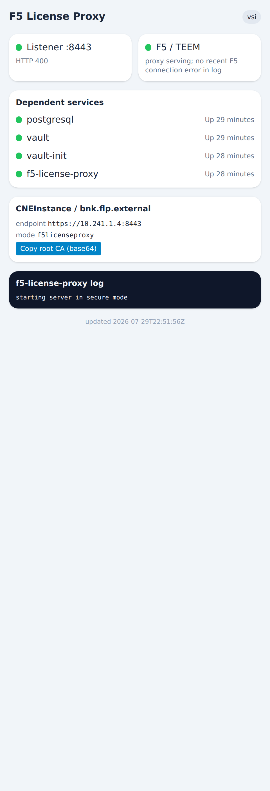

# Appendix A — A disconnected ROKS cluster

This appendix is a manual, end-to-end **runbook** for a genuinely air-gapped BNK cluster — the
cluster has **no Internet egress at all**; only the two service VSIs (Harbor and the FLP) ever
touch the Internet, and only for the two things that intrinsically require F5: pulling the FAR
artifacts and sending F5 **TEEM** telemetry. Everything else is private, over a Transit
Gateway. It combines three chapters into one worked topology:

- [Air-gapped install](./10a-air-gapped-install.md) — mirroring BNK into a private registry
- [The F5 License Proxy](./10c-flp-licensing.md) — licensing without cluster egress
- [Sharing a Transit Gateway](./09a-transit-gateway-sharing.md) — cross-region private reach

## The topology — what reaches the Internet, and what doesn't

The key move: **run `roksbnkctl` on the Harbor VSI itself.** That host is the only one that
needs *both* Internet egress (to pull FAR) *and* private reach to Harbor — and it has both, so
Harbor is addressed by its **private IP everywhere**, with no split-horizon DNS and no separate
jumphost. The cluster is fully private.

```
                          ╔══════════════════ INTERNET ══════════════════╗
                          ║   repo.f5.com (FAR pull)     F5 TEEM (telemetry) ║
                          ╚════════▲═══════════════════════════▲════════════╝
                                   │  ONLY these two VSIs       │
        ┌──────────────────────────┼────────────────────────────┼───────────────────┐
        │ SERVICES VPC  (region A)  │   public gateway = egress   │                   │
        │                          │                             │                   │
        │   ┌───────────────────┐  │        ┌─────────────────┐  │                   │
        │   │  Harbor VSI       │──┘        │  FLP VSI         │──┘                   │
        │   │  • OCI mirror     │           │  • license proxy │  → TEEM to F5        │
        │   │  • hostname =     │           │  • pulls its own │                      │
        │   │    PRIVATE IP     │           │    image (FAR)   │                      │
        │   │  ◀ roksbnkctl RUNS│           └────────▲─────────┘                      │
        │   │    HERE (operator)│                    │  private IP                    │
        │   └─────────▲─────────┘                    │                                │
        └─────────────┼──────────────────────────────┼────────────────────────────────┘
                      │            Transit Gateway (global) — private RFC1918 only
        ┌─────────────┼──────────────────────────────┼────────────────────────────────┐
        │ CLUSTER VPC (region B)   public_gateway: FALSE  — NO worker Internet egress   │
        │             │                              │                                 │
        │   ROKS workers                                                               │
        │     • images + charts ── over TGW ─────▶ Harbor  (private IP)                 │
        │     • licensing ─────── over TGW ─────▶ FLP     (private IP)                  │
        │     • ICR / IAM / COS / master ──▶ 161.26.0.0/16 + 166.8.0.0/14              │
        │                                    (IBM Cloud private service endpoints —     │
        │                                     routable with NO public gateway)          │
        └──────────────────────────────────────────────────────────────────────────────┘
```

**Reachability summary**

| Component | Internet? | How it reaches what it needs |
|---|---|---|
| **Harbor VSI** | **Yes** — FAR pull only | public gateway (services VPC) |
| **FLP VSI** | **Yes** — F5 licensing + TEEM only | public gateway (services VPC) |
| Cluster workers → Harbor / FLP | **No** | private IPs over the Transit Gateway |
| Cluster workers → ICR / IAM / COS / master | **No** | IBM Cloud private service-endpoint CIDRs (`161.26.0.0/16`, `166.8.0.0/14`) — routable without a public gateway |
| Operator (`roksbnkctl`) | runs **on the Harbor VSI** | reaches Harbor locally + FAR/IBM API via the VSI's egress |

> **Why no operator-built VPEs are needed for the platform.** A `public_gateway: false` ROKS
> VPC cluster still reaches its IBM Cloud dependencies privately: system-image pulls use
> **private ICR** (`private.icr.io`), IAM/COS use their **private endpoints**, and the
> **master** is reached over the **private service endpoint ROKS provisions itself**. All of
> those resolve into IBM Cloud's service-endpoint ranges (`161.26.0.0/16`, `166.8.0.0/14`),
> which the VPC routes **without a public gateway**. Calico SNATs pod egress to the node, and
> the node uses those implicit routes. So the platform works private-only out of the box; you
> only add explicit **VPEs** for a *specific* service instance you want on a dedicated private
> endpoint (e.g. a particular COS bucket), not for the core ICR/IAM/COS/master path.

> **roksbnkctl does not build the services VPC, Harbor, or the FLP host image.** It provisions
> no registries and no standalone VPCs (VPC creation only happens inside the cluster phase).
> Step 1 uses the `ibmcloud` CLI for those prerequisites; everything from Step 2 on is
> `roksbnkctl`, **run on the Harbor VSI**.

## Prerequisites

- An **existing global Transit Gateway** (a *global* gateway spans regions; a local one does
  not). Set `TGW_NAME`.
- The `ibmcloud` CLI (with `vpc-infrastructure` + `tg-cli` plugins), `jq`, and an SSH client on
  your workstation. **`roksbnkctl`, `kubectl`, the FAR tarball, and the JWT go on the Harbor
  VSI**, not your workstation.
- An **RSA** VPC SSH key (IBM Cloud VPC rejects ed25519).
- Two regions: `SVC_REGION` (A, services) and `BNK_REGION` (B, cluster).

```bash
export IBMCLOUD_API_KEY=…
export TGW_NAME=my-global-tgw
export SVC_REGION=us-east SVC_ZONE=us-east-1
export BNK_REGION=us-south
ibmcloud login --apikey "$IBMCLOUD_API_KEY" -r "$SVC_REGION" -g default -q
TGW_ID=$(ibmcloud tg gateways --output json | jq -r --arg n "$TGW_NAME" '.[]|select(.name==$n)|.id')
```

## Step 1 — Services VPC + Harbor (the operator host), attached to the TGW

Create the VPC, a subnet with a **public gateway**, a security group opening 22 + 443, and
attach the VPC to the TGW:

```bash
SVC_VPC=$(ibmcloud is vpc-create bnk-svc-vpc --output json | jq -r .id)
SVC_CRN=$(ibmcloud is vpc bnk-svc-vpc --output json | jq -r .crn)
SUBNET=$(ibmcloud is subnet-create bnk-svc-subnet "$SVC_VPC" --zone "$SVC_ZONE" \
           --ipv4-address-count 256 --output json | jq -r .id)
PGW=$(ibmcloud is public-gateway-create bnk-svc-pgw "$SVC_VPC" "$SVC_ZONE" --output json | jq -r .id)
ibmcloud is subnet-update "$SUBNET" --public-gateway-id "$PGW"
SG=$(ibmcloud is vpc "$SVC_VPC" --output json | jq -r .default_security_group.id)
for p in 22 443; do ibmcloud is security-group-rule-add "$SG" inbound tcp --port-min $p --port-max $p; done
ibmcloud tg connection-create "$TGW_ID" --name bnk-svc-conn --network-type vpc --network-id "$SVC_CRN"
```

Launch the Harbor VSI. **Because `roksbnkctl` will run *on this VSI*, Harbor's `hostname` is
simply its own private IP** (`hostname -I`) — the naive choice, which is correct here: the
operator reaches Harbor locally, and the cluster reaches the *same* private IP over the TGW. No
floating IP appears in Harbor's identity; the floating IP is only for your SSH + the VSI's FAR
egress.

```bash
cat > harbor-init.yaml <<'CI'
#cloud-config
packages: [docker.io, docker-compose-v2, openssl]
runcmd:
  - [bash, -lc, "systemctl enable --now docker"]
  - [bash, -lc, "PRIV=$(hostname -I|awk '{print $1}'); mkdir -p /opt/harbor/certs; openssl req -x509 -nodes -days 3650 -newkey rsa:2048 -keyout /opt/harbor/certs/harbor.key -out /opt/harbor/certs/harbor.crt -subj \"/CN=$PRIV\" -addext \"subjectAltName=IP:$PRIV\""]
  - [bash, -lc, "cd /opt/harbor && curl -fsSL -o h.tgz https://github.com/goharbor/harbor/releases/download/v2.11.1/harbor-offline-installer-v2.11.1.tgz && tar xzf h.tgz --strip-components=1"]
  - [bash, -lc, "PRIV=$(hostname -I|awk '{print $1}'); sed -e \"s/^hostname:.*/hostname: $PRIV/\" -e 's#certificate:.*#certificate: /opt/harbor/certs/harbor.crt#' -e 's#private_key:.*#private_key: /opt/harbor/certs/harbor.key#' -e 's/^harbor_admin_password:.*/harbor_admin_password: Harbor12345!/' /opt/harbor/harbor.yml.tmpl > /opt/harbor/harbor.yml"]
  - [bash, -lc, "cd /opt/harbor && ./install.sh && touch /opt/harbor/READY"]
CI

VSI=$(ibmcloud is instance-create bnk-svc-harbor "$SVC_VPC" "$SVC_ZONE" bx2-4x16 "$SUBNET" \
        --image ibm-ubuntu-22-04-5-minimal-amd64-17 --keys "$RSA_KEY_NAME" \
        --user-data @harbor-init.yaml --output json)
HARBOR_PRIVATE_IP=$(echo "$VSI" | jq -r .primary_network_interface.primary_ip.address)
VNI=$(echo "$VSI" | jq -r .primary_network_attachment.virtual_network_interface.id)
FIPID=$(ibmcloud is floating-ip-reserve bnk-svc-harbor-fip --zone "$SVC_ZONE" --output json | jq -r .id)
ibmcloud is virtual-network-interface-floating-ip-add "$VNI" "$FIPID"   # for SSH + FAR egress
HARBOR_FIP=$(ibmcloud is floating-ip "$FIPID" --output json | jq -r .address)
```

### Put the operator on the VSI

The IBM Cloud stock Ubuntu image logs in as **`ubuntu`** (with `sudo`), not `root`. Once
`ssh ubuntu@$HARBOR_FIP 'ls /opt/harbor/READY'` succeeds, copy the operator toolchain onto the
VSI and install roksbnkctl's runtime dependencies — it shells out to **`terraform`**, **`helm`**
(OCI chart pulls), and **`kubectl`**, all of which the VSI pulls over its own egress:

```bash
scp roksbnkctl f5-far-auth-key.tgz subscription.jwt ubuntu@"$HARBOR_FIP":/home/ubuntu/
ssh ubuntu@"$HARBOR_FIP" '
  sudo install -m755 roksbnkctl /usr/local/bin/roksbnkctl
  # terraform (>=1.5), helm (>=3), kubectl — from the VSI'\''s egress
  curl -fsSL https://releases.hashicorp.com/terraform/1.9.8/terraform_1.9.8_linux_amd64.zip -o /tmp/tf.zip
  sudo apt-get install -y unzip && (cd /tmp && unzip -o tf.zip && sudo install -m755 terraform /usr/local/bin/)
  curl -fsSL https://get.helm.sh/helm-v3.16.3-linux-amd64.tar.gz | tar xz -C /tmp && sudo install -m755 /tmp/linux-amd64/helm /usr/local/bin/
  curl -fsSL -o /tmp/kubectl "https://dl.k8s.io/release/$(curl -sL https://dl.k8s.io/release/stable.txt)/bin/linux/amd64/kubectl" && sudo install -m755 /tmp/kubectl /usr/local/bin/
  # trust Harbor'\''s own cert for host-side pulls (no DNS — it is the local private IP)
  sudo cp /opt/harbor/certs/harbor.crt ~/harbor.crt && sudo chown ubuntu ~/harbor.crt
  cat /etc/ssl/certs/ca-certificates.crt ~/harbor.crt > ~/ca-bundle.crt
'
ssh ubuntu@"$HARBOR_FIP"     # ← run Steps 2–5 from this shell, with:
#   export SSL_CERT_FILE=~/ca-bundle.crt
#   export IBMCLOUD_API_KEY=…   (the VSI needs it for cluster config + tfx COS-less flows)
```

Create the `mirror` project in Harbor (`curl -sk -u admin:… -X POST
https://$HARBOR_PRIVATE_IP/api/v2.0/projects -d '{"project_name":"mirror"}'`).

## Step 2 — Mirror FAR → Harbor (on the VSI, over the private IP)

`registry replicate` pulls from `repo.f5.com` (the VSI's egress) and pushes to Harbor at its
**private IP** (local). Give the workspace the FAR service account directly — replicate
resolves its FAR *source* credential from COS or `registry.source_service_account_b64`, not
from `bnk.far_auth_local_file`:

```bash
roksbnkctl tfx far-extract --tarball /root/f5-far-auth-key.tgz --out /root/far-sa.json
FAR_SA_B64=$(cat /root/far-sa.json)
```

```yaml
# mirror.yaml  (on the VSI)
ibmcloud: { region: us-east, resource_group: default }
prefix: mirror
tf_source: { type: embedded }
cluster: { create: false, name: none }
bnk:
  manifest_version: 2.3.0-3.2598.3-0.0.170
  far_auth_local_file: /root/f5-far-auth-key.tgz
  subscription_jwt_local_file: /root/subscription.jwt
registry:
  target: generic
  generic_host: <HARBOR_PRIVATE_IP>          # local to the VSI, private to the cluster
  generic_repo_prefix: mirror
  generic_username: admin
  generic_password_b64: <base64 of the Harbor admin password>
  source_service_account_b64: <FAR_SA_B64>
```

```console
# on the VSI:
$ roksbnkctl -w mirror init --config-file mirror.yaml
$ roksbnkctl -w mirror registry bom          # the bill of materials to mirror
$ roksbnkctl -w mirror registry replicate --registry-ca /opt/harbor/certs/harbor.crt   # FAR → Harbor (89 artifacts); records Harbor's CA
$ roksbnkctl -w mirror registry verify
```

After replication, the `bnk-mirror` project holds every BNK chart and image — the cluster
pulls exclusively from here, by Harbor's private IP over the TGW:


## Step 3 — Standalone FLP licensing appliance (on the VSI)

The FLP is a **self-contained F5 licensing appliance** — a VSI running the `f5-license-proxy`
stack (postgresql, vault, vault-init, f5-license-proxy) as a podman pod, with **no cluster**.
It is the one box with controlled egress to F5: it pulls its own images from `repo.f5.com`
through the services-VPC public gateway and brokers licenses (and sends F5 **TEEM** telemetry)
on the cluster's behalf. Its licensing endpoint is a **private** IP the disconnected cluster
reaches over the TGW.

Because it is its own appliance, it needs two F5 credentials of its own — the same two you'd
give any BNK deploy, but here consumed by the FLP itself, not a cluster:

- **`far_auth_local_file`** — the F5 Artifact Registry service account. The VSI runs
  `podman login repo.f5.com` with it to **pull its own container images**. It's a registry
  pull secret, nothing cluster-specific.
- **`subscription_jwt_local_file`** — your **subscription entitlement token**. It's injected as
  the proxy's `JWT_TOKEN`; the proxy presents it to F5's licensing backend to broker licenses.
  Required — the appliance will not start without it.

> Both can equally come from **COS** instead of local files — set `bnk.far_auth_file` +
> `bnk.subscription_jwt_file` (the COS object keys) and omit the `*_local_file` fields; that is
> the default path (`use_cos_bucket=true`). The disconnected runbook uses **local files** so the
> FLP has no COS dependency.

> **Do not put `license_mode: f5licenseproxy` here** — that is the *consuming cluster's*
> License-CR setting (it goes in `cluster.yaml`, Step 4). `flp up` never reads it. The FLP-only
> workspace needs only the two credentials above plus the `flp.vsi` block. `manifest_version`
> **is** needed — it selects which `f5-license-proxy` image version to run.

The minimal standalone `flp.yaml`:

```yaml
# flp.yaml  (on the VSI)
ibmcloud: { region: us-east, resource_group: default }
prefix: flp
tf_source: { type: embedded }
cluster: { create: false, name: none }          # no cluster — the flp phase only
bnk:
  manifest_version: 2.3.0-3.2598.3-0.0.170       # selects the f5-license-proxy image version
  far_auth_local_file: /root/f5-far-auth-key.tgz         # podman login repo.f5.com → pull images
  subscription_jwt_local_file: /root/subscription.jwt    # the proxy's entitlement token
  flp:
    mode: vsi
    vsi:
      vpc: <SVC_VPC>                # the VPC the appliance lands in (attach it to the TGW)
      # zone: us-east-1             # optional — defaults to <region>-1
      # profile: bx2-4x16          # optional — default; meets the FLP's 4 vCPU / 8 GB minimum
      # ssh_key: <vpc-ssh-key>     # optional — attach to SSH in (:22, licensing plane)
      # floating_ip: true          # optional — DEFAULT true; operator management IP (see below)
      # management_allowed_cidrs: [ 0.0.0.0/0 ]                       # :80 web UI — default open
      # licensing_allowed_cidrs:  [ 10.0.0.0/8, 172.16.0.0/12, 192.168.0.0/16 ]  # :8443 — default RFC-1918
```

Everything commented is optional and defaults as noted. The only field with no default is
`vsi.vpc` — a standalone FLP has no cluster VPC to fall back to, so name the VPC explicitly (and
attach it to your Transit Gateway so the disconnected cluster can reach the proxy privately).

**Operator floating IP (`floating_ip`, default `true`).** The appliance also gets a floating IP
purely as a **management path** — so `roksbnkctl flp status` and the `:80` status web UI are
reachable from a machine *outside* the VPC. It is **not** the licensing endpoint (the cluster
always reaches the proxy privately over the TGW). The floating IP is added to the proxy's cert
SAN and recorded in `flp-outputs.json` so `flp status` targets it automatically. Set
`floating_ip: false` to opt out.

**Security-group CIDRs split by plane (safe defaults).** Because the floating IP is public, the
VSI's ingress is scoped per purpose, each with a sane default so you rarely set either:

- **`management_allowed_cidrs`** → the `:80` flp-status web UI (read-only status). Defaults to
  `0.0.0.0/0` — **open**, since the page carries no secrets. Restrict it if you want.
- **`licensing_allowed_cidrs`** → the `:8443` proxy (and `:22` SSH). Defaults to the **RFC-1918**
  private ranges — the cluster reaches the proxy privately over the TGW, so it never needs a
  public source. Widen it only if a consumer sits outside RFC-1918 space.

(The older single `allowed_cidrs` is deprecated; if set it seeds both planes.)

Then deploy — only the flp phase runs (no cluster, BNK, or testing):

```console
$ roksbnkctl -w flp init --config-file flp.yaml
$ roksbnkctl -w flp flp up --auto
$ roksbnkctl -w flp flp output    # flp_external_endpoint (https://<private-ip>:8443) + flp_root_ca
$ roksbnkctl -w flp flp status    # health of every dependent service + the web-UI link
```

Copy the `flp_external_endpoint` and `flp_root_ca` from `flp output` into the cluster's
`bnk.flp.external` in Step 4.

### The status web UI

`roksbnkctl flp status` prints the live health of the appliance **and the web-UI URL** — it
derives the URL from `flp-outputs.json`, preferring the operator floating IP when one is attached:

```console
$ roksbnkctl -w flp flp status
F5 License Proxy  (deployment: vsi, checked …)
  web UI: http://169.63.101.72/
  ● listener   https://localhost:8443/  (HTTP 400)
  ● F5 / TEEM  proxy serving; no recent F5 connection error in log
  dependent services:
    ● postgresql         Up 28 minutes
    ● vault              Up 28 minutes
    ● vault-init         Up 28 minutes
    ● f5-license-proxy   Up 28 minutes
  …
```

Open that URL in a browser for the mobile-friendly status page — a green/red indicator for **every**
dependent service, the `:8443` listener and F5/TEEM connection state, the CNEInstance fields
(endpoint + a **Copy root CA** button, ready to paste into `bnk.flp.external`), and a live
`f5-license-proxy` log stream. It is plain HTTP with **no auth** (read-only status), reachable from
outside the VPC via the floating IP (the `:80` management plane defaults open). The floating IP is
also available directly as `flp_floating_ip` in `flp output`.



> A FLP-only workspace is created from this config file (`init --config-file`). The interactive
> `roksbnkctl init` builds a full cluster + BNK workspace and can add an FLP as part of it, but
> the standalone cluster-less appliance is driven by the `flp.yaml` above.

## Step 4 — The air-gapped cluster, joined to the TGW (on the VSI)

`public_gateway: false` — **no worker egress**. The `registry:` block points at Harbor's
private IP (over the TGW), and `bnk.flp.external` at the FLP from Step 3:

```yaml
# cluster.yaml  (on the VSI)
ibmcloud: { region: us-south, resource_group: default }
prefix: bnk
tf_source: { type: embedded }
cluster:
  create: true
  name: bnk-roks
  openshift_version: "4.18"
  workers_per_zone: 2
  public_gateway: false           # air-gapped — no worker Internet egress
resources:
  transit_gateway: { create: false, existing: my-global-tgw }
  registry_cos:    { create: true }   # REQUIRED — ROKS-on-VPC internal registry (see below)
  cert_manager:    { create: true }
  bnk:             { create: true }
  tgw_jumphost:    { create: false }
  cluster_jumphosts: { create: false }
  client_vpc:      { create: false }
registry:
  target: generic
  generic_host: <HARBOR_PRIVATE_IP>   # over the TGW
  generic_repo_prefix: mirror
  generic_username: admin
  generic_password_b64: <base64 of the Harbor admin password>
bnk:
  manifest_version: 2.3.0-3.2598.3-0.0.170
  far_auth_local_file: /root/f5-far-auth-key.tgz
  subscription_jwt_local_file: /root/subscription.jwt
  license_mode: f5licenseproxy
  flp:
    external:
      url: <flp_external_endpoint from Step 3>
      root_ca_b64: <flp_root_ca from Step 3>
```

The demo **adopts an existing cluster** (the common case). Set
`cluster: { create: false, name: <existing-cluster> }` and `registry_cos: { create: false }` in
`cluster.yaml`, then **register** it (records its identity — VPC, endpoints, registry COS — into
`cluster-outputs.json`, which activates `bnk up`'s existing-cluster path) and pull its admin
kubeconfig for `kubectl`:

```console
$ roksbnkctl -w bnk init --config-file cluster.yaml
$ roksbnkctl -w bnk cluster register <existing-cluster>   # writes cluster-outputs.json
$ roksbnkctl -w bnk kubeconfig --download                 # ~/.kube/config for kubectl
```

Ensure the existing cluster's VPC is attached to the same global Transit Gateway and its address
prefixes don't overlap the services VPC (so Harbor's private IP is routable from the nodes). If its
VPC isn't on the TGW yet, attach it (idempotent): `roksbnkctl -w bnk tgw connect <your-global-tgw>`.

### Alternative — create the cluster here

To build the cluster instead of adopting one, set `cluster: { create: true }` +
`registry_cos: { create: true }` and:

```console
$ roksbnkctl -w bnk init --config-file cluster.yaml
$ roksbnkctl -w bnk cluster up            # ~45–55 min; TGW connect runs at the end
$ roksbnkctl -w bnk tgw status
```

> **⚠ Confirmed — `registry_cos: { create: true }` is mandatory** *when creating* the cluster. ROKS-on-VPC refuses to
> provision without a COS instance backing its **internal** image registry (`E7278`). This is
> IBM Cloud COS reached over the private service-endpoint range — needed even air-gapped.
> `create: false` fails the cluster create outright.

### Node CA trust is automatic

Before pulling, CRI-O on each node must trust Harbor's self-signed cert or every pull fails `x509`.
**The usual OpenShift mechanism does not work on ROKS** — `image.config.openshift.io/cluster` is
HostedCluster-managed and a ValidatingAdmissionPolicy denies edits. `bnk up` handles it: it installs
the CA — captured into the mirror record by `registry replicate --registry-ca` (Step 2) — into each
node's `/etc/containers/certs.d/<HARBOR_PRIVATE_IP>/ca.crt` via a privileged DaemonSet (one pod per
node, a **node-cached** image so it needs no egress, self-refreshing if the CA changes on a
cluster/Harbor rebuild), then gates the install on the CA landing on every node. Nothing to apply by
hand. Because Harbor is addressed by an **IP**, the `certs.d` key is that IP — no node `/etc/hosts`
entry needed.

## Step 5 — Install BNK, air-gapped (on the VSI)

`bnk up` requires a populated `registry-mirror.json` in **this** (cluster) workspace. You
replicated in the `mirror` workspace (Step 2); since both live under the same
`~/.roksbnkctl` on the VSI, that's a one-line local copy — no cross-host transfer (or replicate
directly in the `bnk` workspace to skip it):

```bash
cp ~/.roksbnkctl/mirror/registry-mirror.json ~/.roksbnkctl/bnk/registry-mirror.json
```

Keep `SSL_CERT_FILE` pointed at Harbor's cert (the chart pulls run host-side, i.e. on the VSI):

```console
$ export SSL_CERT_FILE=/opt/harbor/certs/harbor.crt
$ roksbnkctl -w bnk bnk up --auto     # installs node CA trust, pulls from Harbor, licenses via the FLP — one pass
```

> **One pass.** The `external-vlan`/`internal-vlan` (`F5SPKVlan`) CRs are admitted
> by the `f5validate` webhook, whose TLS server comes up a few seconds *after*
> `CNEControllerAvailable=True`. `bnk up` gates the VLAN applies on a **dry-run
> admission probe** of `f5-spk-vlans` that retries until the webhook accepts, so
> the CRs land the first time. (The License CR has its own admission-retry.)

Verify — every pull private, nothing off the cluster to the Internet:

```console
$ kubectl get pods -n f5-bnk                     # all Running — images all from <HARBOR_PRIVATE_IP>
$ kubectl get license -n f5-utils                # STATE: Active   MODE: f5licenseproxy
$ kubectl get cneinstance -n f5-bnk -o \
    jsonpath='{.items[0].status.conditions[?(@.type=="Available")].status}'   # True
```

## Teardown

```console
$ roksbnkctl -w bnk  down --auto     # cluster + BNK (+ detaches its TGW connection)
$ roksbnkctl -w flp down --auto     # the standalone FLP VSI
$ ibmcloud is instance-delete bnk-svc-harbor --force
$ ibmcloud is floating-ip-release "$FIPID" --force
$ ibmcloud tg connection-delete "$TGW_ID" <services-conn-id>
$ ibmcloud is vpc-delete "$SVC_VPC" --force   # after its subnet / public gateway / floating IP are gone
```

## The scripted walkthrough (CLI)

Everything above is scripted, phase-by-phase, in
`scripts/demos/disconnected-cluster-cli-demo/` — a fully reproducible, parameterized walkthrough.
It reads its inputs from a `.env` (only `IBMCLOUD_API_KEY` is strictly required), auto-advances
between phases, and drives the exact commands in this appendix. Node CA trust is handled by `bnk up`
itself — it installs Harbor's CA on every node before pulling (see
[Step 5](#step-5--install-bnk-air-gapped-on-the-vsi)), so there is no manual DaemonSet to apply.

### What to expect — timing

A clean end-to-end run is roughly **45–65 minutes**, dominated by `bnk up`. The steps map to these
typical durations (they vary with region load, image count, and cluster size):

| Step | Typical duration |
|---|---|
| Step 1 — Services VPC + Harbor VSI (cloud-init installs Harbor) | ~8–10 min |
| Step 2 — Mirror FAR → Harbor (`registry replicate`, many images) | ~8–15 min |
| Step 3 — Standalone FLP appliance up | ~5–8 min |
| Step 4 — Adopt the cluster + node CA trust | ~3–5 min |
| Step 5 — `bnk up` converges (cert-manager → FLO → CNE → license → f5-spk) | ~20–30 min |

`bnk up` is the long, variable one: it gates on **real readiness** at every stage (helm `wait`,
`kubectl_manifest` `wait_for`, and the node-CA-trust installer reaching every node), so a clean apply
*is* the convergence — there is no "run it twice." The other steps are one-time services
infrastructure; a second install that reuses the same Harbor and FLP skips Steps 1–3 entirely and is
just Steps 4–5.

## The same flow as CI — the container runner

The CLI walkthrough above is the *narrative*; this is the same five steps as a pipeline, using the
all-in-one **runner image** (`roksbnkctl` plus every tool on `PATH`). The one shape change from the CLI
walkthrough: where the operator VSI read the FAR auth archive and subscription JWT from **local files**,
CI reads them from the **registry COS bucket** by their object keys — the standard supply-chain store
(upload them once; see [Chapter 25 — the COS supply chain](./25-cos-supply-chain.md)). So there are no
secret files to mount: only the manifest version and where the mirror is need a small `config.yaml`, and
the secrets + FLP handoff late-bind from the environment with `--override-from-env`. For the general CI
contract see [Chapter 7b — GitHub Actions](./07b-github-actions-ci.md) and the env map in
[Unattended setup](./07a-unattended-setup.md#-override-from-env); this section only adds what is specific
to the disconnected, standalone-VSI topology.

> **One constraint the connected flows don't have.** The runner must sit where it can reach Harbor's
> **private IP** and the cluster **over the TGW** — a GitHub-*hosted* runner can't. Run it on a
> **self-hosted runner inside the services VPC**, or invoke the container **on the operator (Harbor)
> VSI** itself. Harbor and the FLP VSI are standing services infrastructure ([Steps 1](#step-1--services-vpc--harbor-the-operator-host-attached-to-the-tgw)
> and [3](#step-3--standalone-flp-licensing-appliance-on-the-vsi)); the mirror-refresh + install below
> is what CI repeats.

### As a script (plain `docker run` — what a CI runner does)

```bash
#!/usr/bin/env bash
# Secrets come from the CI vault, never the repo. IBMCLOUD_API_KEY, the Harbor
# password, and the FLP handoff (URL + CA) are exported by the runner. The FAR
# archive + subscription JWT already live in the registry COS bucket — CI reads
# them from there with the API key, so there is nothing to mount.
set -euo pipefail
RUNNER=ghcr.io/jgruberf5/roksbnkctl-tools-runner:v1.33.0     # pin by @sha256 digest in prod
COMMON=( --rm -v "$PWD/state:/work" -e IBMCLOUD_API_KEY )

# config.yaml carries only what env can't: the manifest + where the mirror is.
cat > state/config.yaml <<'YAML'
ibmcloud: { region: us-south, resource_group: default }
prefix: bnk
cluster: { name: disco-demo, create: false }          # adopt the EXISTING cluster
registry:
  target: generic
  generic_host: 10.241.0.4                             # Harbor by PRIVATE IP over the TGW
  generic_repo_prefix: mirror
  generic_username: admin
bnk:
  manifest_version: 2.3.0-3.2598.3-0.0.170
  license_mode: f5licenseproxy
  # FAR auth + JWT are read from the registry COS bucket by their default object
  # keys (f5-far-auth-key.tgz / subscription.jwt) — upload them once (Chapter 25).
YAML

export ROKSBNKCTL_GENERIC_PASSWORD="$HARBOR_PW"          # base64'd into the config by init
export ROKSBNKCTL_FLP_EXTERNAL_URL="$FLP_URL"            # the FLP VSI's endpoint …
export ROKSBNKCTL_FLP_ROOT_CA_B64="$FLP_CA_B64"          # … and its CA (already base64)
run(){ docker run "${COMMON[@]}" -e ROKSBNKCTL_GENERIC_PASSWORD \
        -e ROKSBNKCTL_FLP_EXTERNAL_URL -e ROKSBNKCTL_FLP_ROOT_CA_B64 "$RUNNER" -w bnk "$@"; }

run init --config-file /work/config.yaml --override-from-env
run registry replicate --target generic     # Step 2 — mirror FAR→Harbor; auto-captures Harbor's CA
run registry verify
run cluster register disco-demo             # Step 4 — adopt
run bnk up --auto                           # Step 5 — disconnected: installs node CA trust, pulls from Harbor, licenses via the FLP, reads FAR/JWT from COS
```

`registry replicate` captures Harbor's self-signed CA into the mirror record automatically; pass
`--registry-ca <file>` only to supply it explicitly. `-v "$PWD/state:/work"` persists the workspace —
config, terraform state, and the mirror record (with the CA) — across steps; on an ephemeral runner,
back it with COS remote state instead so a later teardown run still sees it — see
[Chapter 7b §"Ephemeral runners need remote state"](./07b-github-actions-ci.md#ephemeral-runners-need-remote-state).

### As an ArgoCD Application (GitOps)

To drive it from GitOps, a Git repo holds a Kubernetes **Job** that runs the runner image through the
same five steps, plus a `ConfigMap` (the `bnk.yaml` shape) and a `Secret` (the credentials). ArgoCD
syncs them into a **management cluster that sits in the services VPC** — the same private-IP / TGW
reachability the runner needs; a *hosted* ArgoCD can't reach Harbor's private IP or the target cluster.
The `argocd` CLI registers and syncs the app.

The Git path (`disconnected-bnk/`) — the runner as a one-shot Job plus its config:

```yaml
apiVersion: v1
kind: ConfigMap
metadata: { name: bnk-config, namespace: bnk-ci }
data:
  bnk.yaml: |
    ibmcloud: { region: us-south, resource_group: default }
    prefix: bnk
    cluster:  { name: disco-demo, create: false }        # adopt the EXISTING cluster
    registry: { target: generic, generic_host: 10.241.0.4, generic_repo_prefix: mirror, generic_username: admin }
    bnk:      { manifest_version: 2.3.0-3.2598.3-0.0.170, license_mode: f5licenseproxy }
---
apiVersion: batch/v1
kind: Job
metadata: { name: bnk-disconnected-install, namespace: bnk-ci }
spec:
  backoffLimit: 1
  template:
    spec:
      restartPolicy: Never
      volumes:
        - { name: config, configMap: { name: bnk-config } }
        - { name: work,   emptyDir: {} }        # back with a PVC or COS remote state for idempotent re-syncs
      containers:
        - name: roksbnkctl
          image: ghcr.io/jgruberf5/roksbnkctl-tools-runner:v1.33.0
          envFrom:
            - secretRef: { name: bnk-secrets }   # IBMCLOUD_API_KEY, ROKSBNKCTL_GENERIC_PASSWORD, ROKSBNKCTL_FLP_EXTERNAL_URL, ROKSBNKCTL_FLP_ROOT_CA_B64
          volumeMounts:
            - { name: config, mountPath: /config }
            - { name: work,   mountPath: /work }
          command: [/bin/sh, -ec]
          args:
            - |
              roksbnkctl -w bnk init --config-file /config/bnk.yaml --override-from-env
              roksbnkctl -w bnk registry replicate --target generic   # auto-captures Harbor's CA
              roksbnkctl -w bnk registry verify
              roksbnkctl -w bnk cluster register disco-demo            # adopt
              roksbnkctl -w bnk bnk up --auto                         # FAR/JWT read from the COS bucket
```

Register and run it with the `argocd` CLI, pointed at the in-VPC management cluster:

```bash
argocd app create bnk-disconnected \
  --repo https://git.example.com/infra/bnk-gitops.git --path disconnected-bnk \
  --dest-server https://kubernetes.default.svc --dest-namespace bnk-ci \
  --sync-option CreateNamespace=true

argocd app sync bnk-disconnected      # runs the Job → the disconnected install
argocd app wait bnk-disconnected --health
argocd app logs bnk-disconnected -f   # follow bnk up
```

The `Secret bnk-secrets` (API key, Harbor password, FLP endpoint + CA) comes from a sealed-secret or the
External Secrets operator — never committed; `init` applies them via `--override-from-env` and logs only
which fields, never the values. Because this is a one-shot *provisioning* Job, drive it with an explicit
`argocd app sync` (or a `Sync`/`PostSync` hook), not continuous auto-sync, and back `/work` with a PVC or
COS remote state so a re-sync is an idempotent no-op rather than a fresh run.

> The two-*cluster* variant — an in-cluster FLP in a services cluster rather than a standalone VSI — is
> [Flow C in CI](./10c-flp-licensing.md#flow-c-in-ci--the-runner-container-no-host-install).
