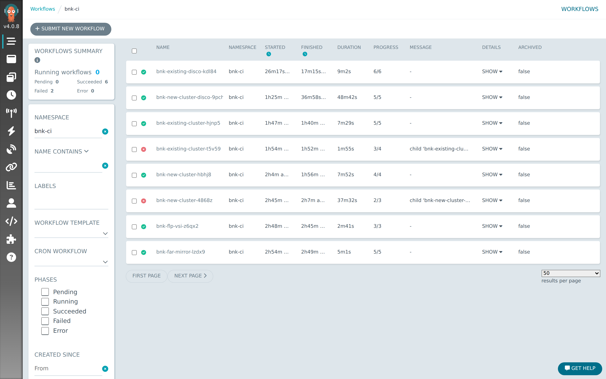
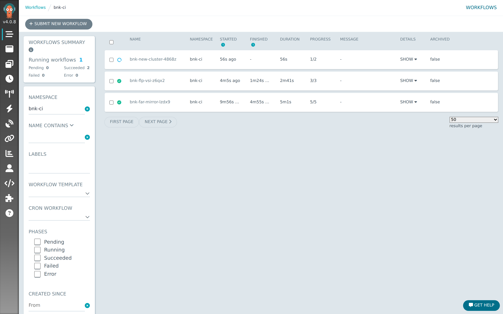
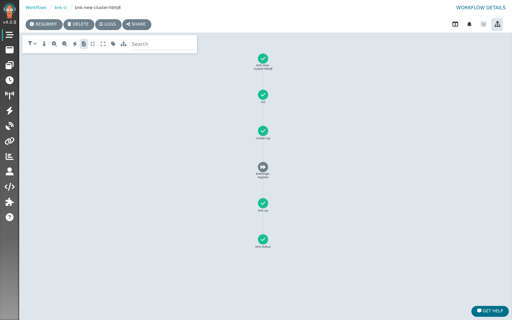
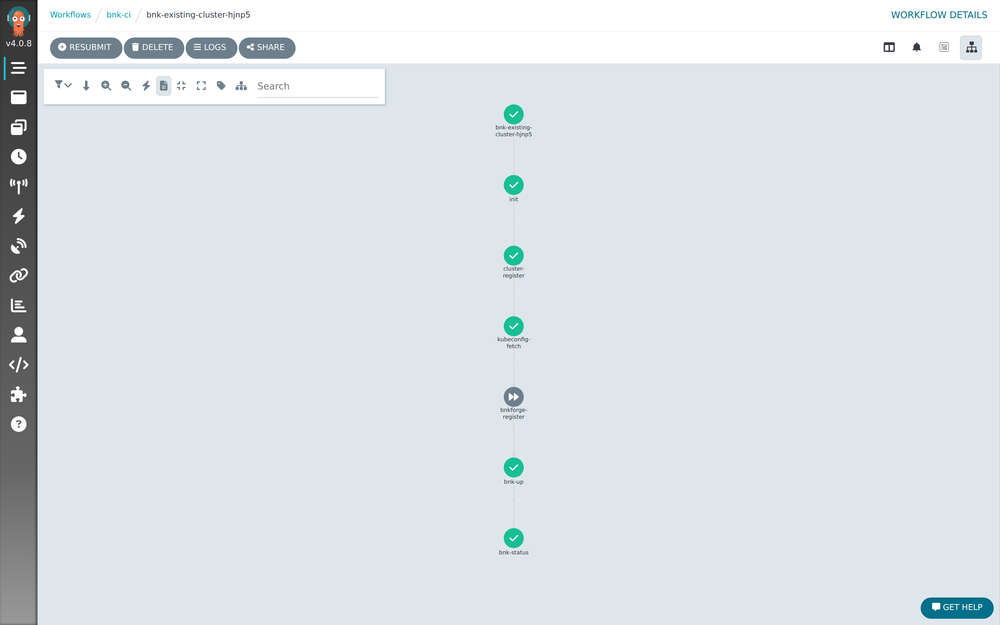
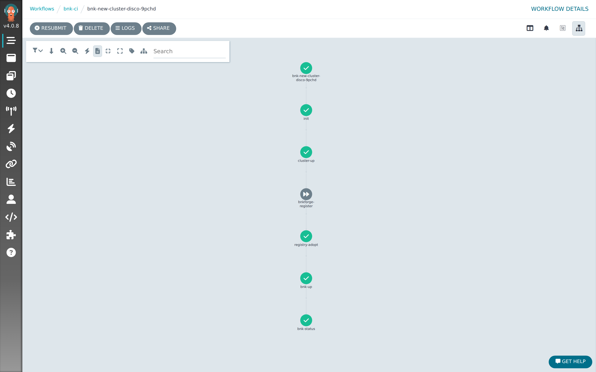
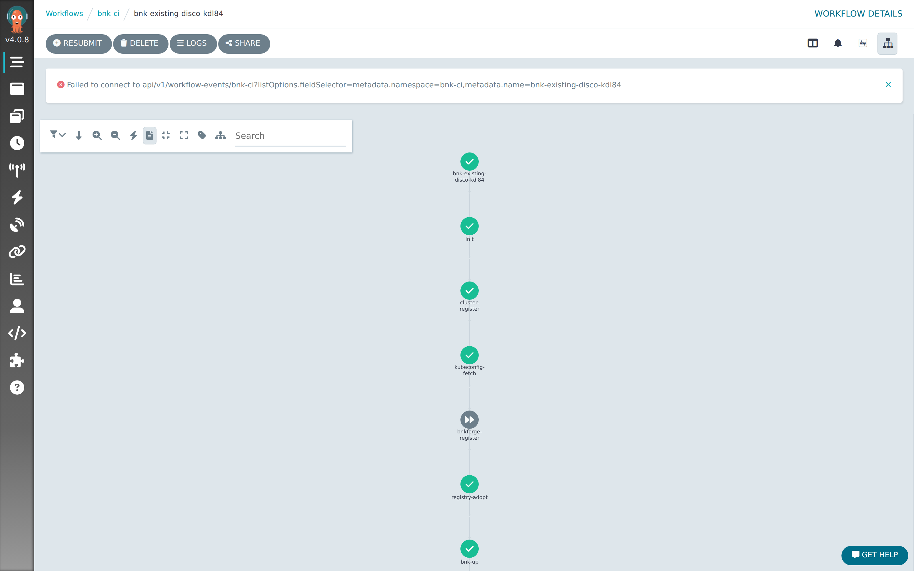
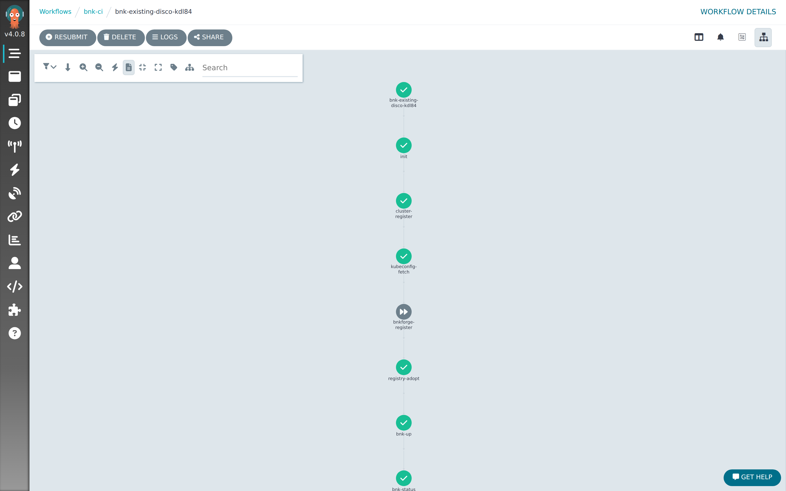

# An end to end demo using Argo Workflows and roksbnkctl for deployment use cases

This guide walks through installing **BIG-IP Next for Kubernetes (BNK)** onto IBM
Cloud ROKS clusters using **Argo Workflows** and **roksbnkctl**, covering four
deployment situations you are likely to meet in the field.

It is the pipeline-driven counterpart to the BNK Forge guide. Where Forge gives you a
form, Argo gives you a YAML file you submit — the same six blueprints, step for step.
Everything a step needs arrives as an **environment variable**: there is no
`config.yaml` anywhere in this demo, because a CI runner has no shell, no prompts and
nowhere to stage a file.

**Before you start you need**

| | |
|---|---|
| A cluster running Argo Workflows | **v4.0.8** or later, and the `argo` CLI |
| An IBM Cloud API key | able to create VPCs, clusters and Transit Gateways |
| IBM Cloud Object Storage | holding your F5 FAR auth key and subscription JWT |
| A Transit Gateway | existing, for the disconnected use cases |
| The runner image | `ghcr.io/jgruberf5/roksbnkctl-tools-runner:v1.59.1` or later |

Everything else — the services VPC, the private registry, the licence proxy, even the
Argo controller itself — is built for you by `bootstrap`.

---

## The four use cases

| # | Use case | Workflow | What it creates | Where images come from |
|---|---|---|---|---|
| **1** | **New cluster, connected** | `wf-new-cluster.yaml` | VPC, ROKS cluster, Transit Gateway | F5's registry, direct |
| **2** | **New cluster, disconnected** | `wf-new-cluster-disconnected.yaml` | VPC, ROKS cluster | your private mirror |
| **3** | **Existing cluster, connected** | `wf-existing-cluster.yaml` | nothing — adopts your cluster | F5's registry, direct |
| **4** | **Existing cluster, disconnected** | `wf-existing-disconnected.yaml` | nothing — adopts your cluster | your private mirror |

"Connected" means the cluster's worker nodes can reach the Internet, so BNK pulls
straight from F5 and licenses directly. "Disconnected" means they cannot: images come
from a private registry you have mirrored, and licensing goes through an F5 License
Proxy running inside your network.

Use cases 2 and 4 need two supporting pieces built first — a private registry and a
License Proxy. Workflows are provided for both, and **Step 3** walks through them.
Build them once and several disconnected clusters can share them.

---

## Step 1 — Build the substrate

One command builds everything except the Transit Gateway:

```bash
export IBMCLOUD_API_KEY=… TGW_NAME=bnkci-testing
./blueprint-workflows-ci-demo.sh bootstrap
```

It creates an SSH key, the services VPC and its gateway attachment, a Harbor
registry, and a VSI running k3s + Argo Workflows. It is **idempotent** — re-running
after a partial failure continues rather than duplicating.

> **Why the gateway is the exception.** It is the one genuinely shared, long-lived
> resource: the mirror, the licence proxy and every disconnected cluster attach to it.
> Attaching is cheap and reversible; owning it is not. Create it once with
> `ibmcloud tg gateway-create --name bnkci-testing --location us-south --routing global`.

Fold the generated values into `.env`, then open the tunnel it prints. The k3s API is
deliberately **not** published — only 22 and 443 are open on the services VPC.

```bash
ssh -i <key> -N -L 6443:127.0.0.1:6443 -L 2746:127.0.0.1:30746 ubuntu@<argo-fip> &
```

The second forward is the Argo web UI, at `https://localhost:2746`.

### Give the cluster VPC its own address block

`ROKSBNKCTL_CLUSTER_VPC_CIDR` must not overlap anything already on the gateway.

A transit gateway cannot route to two VPCs with overlapping prefixes — it silently
blackholes one. It does **not** surface as a routing error. It surfaces as
*intermittent image-pull timeouts from the mirror*, with every security group and ACL
in the path allowing the traffic, which sends you looking at firewalls.

The demo refuses to submit when it detects this, naming the VPC it collides with:

```
Refusing: ROKSBNKCTL_CLUSTER_VPC_CIDR (10.242.0.0/16) overlaps a VPC already on bnkci-testing.
    • forge-app-eu-gb-1 (eu-gb): 10.242.64.0/18 10.242.128.0/18 10.242.0.0/18
```

Attached VPCs may live in **any** region — the gateway is global-routing, which is the
whole point of it.

---

## Step 2 — Submit a workflow

Everything is submitted the same way:

```bash
argo submit -n bnk-ci workflows/wf-new-cluster.yaml
```

or through the UI's **+ SUBMIT NEW WORKFLOW** button, which opens the manifest with
its parameters ready to edit:



The workflow list is the home screen:



Each row is one run: its phase, how long it took, and how many steps have finished.

---

## Step 3 — Build the registry and the licence proxy (use cases 2 and 4 only)

### 3a — Mirror F5's registry into Harbor

```bash
./blueprint-workflows-ci-demo.sh far-mirror
```

Five steps: `init` → `show-target` → `registry-bom` → `registry-replicate` →
`registry-verify`.


`registry-verify` is the one that matters — a mirror that *looks* full but is missing a
layer fails much later, as an image pull on a cluster with no route to anywhere else.
On the run captured here it mirrored **89 repositories**.

### 3b — The F5 License Proxy

```bash
./blueprint-workflows-ci-demo.sh flp-vsi
```

Three steps: `init` → `flp-up` → `handoff`. Its last step writes the `flp-handoff` Secret, holding the proxy's endpoint and CA.
The disconnected workflows `envFrom` that Secret, so **those two values never pass
through a human** — leave `ROKSBNKCTL_FLP_EXTERNAL_URL` and
`ROKSBNKCTL_FLP_ROOT_CA_B64` empty in `.env` unless the proxy was built elsewhere.

---

## Step 4 — Use case 1: a new connected cluster

```bash
./blueprint-workflows-ci-demo.sh new-cluster
```

Five steps: `init` → `cluster-up` → `bnkforge-register` → `bnk-up` → `bnk-status`.



This variant makes its **own** Transit Gateway and returns it on teardown, so it does
not touch the shared one. It also has no registry at all — "connected" means rendering
against `far_repo_url` directly. The workflow blanks the registry settings it inherits
from `bnk-env`, so nothing is required of you here.

---

## Step 5 — Use case 3: adopt a connected cluster

`wf-existing-cluster.yaml` provisions nothing. It records the cluster's identity and
installs BNK onto it.



### Remove BNK first

You cannot run use case 3 against a cluster that use case 1 just installed BNK onto.
The adopting workspace has no terraform state for that install, so `bnk up` refuses
immediately:

```
cluster "bnk-ci" already has BNK installed (the F5 Lifecycle Operator is running in
namespace "f5-bnk"), but workspace "bnkadopt" has no terraform state for it.
```

Remove BNK from the workspace that installed it first:

```bash
./blueprint-workflows-ci-demo.sh bnk-down bnkconn
```

which removes BNK and **leaves the cluster, its VPC and its gateway up**, ready to be
adopted. Do not use `teardown bnkconn` for this — that also runs `cluster down` and
destroys the very cluster you are about to adopt.

---

## Step 6 — Use case 2: a new disconnected cluster

```bash
./blueprint-workflows-ci-demo.sh new-cluster-disconnected
```



This is the variant that differs from use case 1 in essentially one line —
`public_gateway: false`. The consequences are everything else: no worker egress, so
every image comes from the mirror, and licensing goes through the proxy.

It also **joins the shared Transit Gateway** rather than making its own, which is what
gives it a route to Harbor and the licence proxy in the services VPC.

### The reachability gate

Before `bnk up` plans anything it probes the mirror and the licence proxy **from every
node, in every zone**:

```
→ installing registry CA trust on all nodes (10.241.0.4) and checking reachability
  each target is retried for up to 180s before it is called unreachable (bnk.preflight.reachability_retry_seconds)
  F5-License-Proxy: 3/3 nodes reachable
    ✓ kube-…-000001f8 -> F5-License-Proxy (10.241.1.4:8443): dns=skipped-ip tcp=ok
  registry: 3/3 nodes reachable
    ✓ kube-…-000001f8 -> registry (10.241.0.4:443): dns=skipped-ip tcp=ok
✓ registry CA installed on all nodes; 10.241.0.4 is trusted and reachable
```

The retry matters here specifically. This workflow attaches its VPC to the gateway and
installs in the **same run**, and a Transit Gateway attachment is asynchronous — IBM
programs the routes some time after the connection reports `attached`. A single-shot
probe can beat route programming and fail a path that is perfectly correct. Raise
`ROKSBNKCTL_REACHABILITY_RETRY_SECONDS` if your fabric is slower than the 180s default.

---

## Step 7 — Use case 4: adopt a disconnected cluster

```bash
./blueprint-workflows-ci-demo.sh bnk-down bnkdisco      # BNK off, cluster stays
./blueprint-workflows-ci-demo.sh existing-disconnected
```



Six steps — this variant carries the **cwc guard** as a sidecar of `bnk up`, because a
Multi-Attach deadlock on the CWC volume is what makes `bnk up` fail on a re-used
cluster.

Any step's logs are one click away, which is where you look when something stalls:



---

## Confirming BNK is running

The workflow's last step runs `bnk status`, but that reports terraform's view. To see
the cluster itself:

```bash
ibmcloud ks cluster config --cluster <id> --admin
kubectl get pods -n f5-bnk
```

On the runs captured here that was **14 pods Running** — TMM, the CNE controller, DSSM
(three replicas plus three sentinels), CIS, AFM and the downloader.

For a disconnected cluster, confirm the images actually came from your mirror:

```console
$ kubectl get pods -n f5-bnk -o jsonpath='{range .items[*]}{.spec.containers[0].image}{"\n"}{end}' | sort -u
10.241.0.4/bnk-mirror/images/f5-bnk-cis:v3.0.6-0.0.5
10.241.0.4/bnk-mirror/images/f5-downloader:v0.32.11-0.0.5
10.241.0.4/bnk-mirror/images/f5-dssm-store:v5.1.49-0.0.3
```

If those still say `repo.f5.com`, the workspace never picked up the mirror — check
`ROKSBNKCTL_REGISTRY_TARGET` and that `registry adopt` ran.

---

## Removing a demo

Teardown runs as **workflows**, like everything else — visible in the Argo UI,
re-runnable, and executable by a pipeline rather than only from a laptop.

| Workflow | Removes |
|---|---|
| `wf-down-connected.yaml` | the connected workspace (`bnkconn`) |
| `wf-down-disconnected.yaml` | the disconnected workspace (`bnkdisco`) |
| `wf-down-flp-vsi.yaml` | the F5 License Proxy VSI |

```bash
./blueprint-workflows-ci-demo.sh teardown            # all three
./blueprint-workflows-ci-demo.sh teardown bnkdisco   # one workspace
```

### Order matters

Each cluster workflow runs `bnk down` → `tgw disconnect` → `cluster down`, and that
order is load-bearing: `cluster down` refuses while a gateway connection exists,
because the connection pins the VPC's CRN and the VPC delete would fail.
`tgw disconnect` removes **only this cluster's** connection — the shared gateway and
everyone else's attachments stay.

**Adopted clusters are never destroyed.** The `existing-*` workflows registered them;
they did not create them.

### Removing BNK but keeping the cluster

```bash
./blueprint-workflows-ci-demo.sh bnk-down bnkconn
```

That is `phase=bnk` on the same workflow — BNK goes, the cluster, VPC and gateway
stay. It is what you want between a build variant and its reuse variant. Do **not**
use `teardown` for it: that is `phase=all`, and it destroys the cluster you are about
to adopt.

### The substrate is not a workflow

```bash
./blueprint-workflows-ci-demo.sh unbootstrap
```

This one deliberately is **not** an Argo workflow, and cannot be: the Argo VSI is the
node those workflows are scheduled on, and Harbor and the services VPC are how they
reach anything. A pod cannot outlive its host, so the last step runs from outside the
cluster.

It removes what `bootstrap` created — both VSIs, the services VPC with its subnet and
public gateway, the floating IPs, the SSH key, and this demo's gateway attachment — in
dependency order. The **shared transit gateway is never deleted**; the demo does not
create it, other projects attach to it, and only this demo's connection is removed.

> Do not skip it. `teardown` alone leaves both VSIs, the services VPC, the floating
> IPs and the SSH key running — and nothing else will remove them.

## If something goes wrong

**`cluster "…" already has BNK installed … but workspace "…" has no terraform state for it`**
You are adopting a cluster that still has BNK on it from another workspace. Run
`bnk-down <the workspace that installed it>` first.

**`Refusing: ROKSBNKCTL_CLUSTER_VPC_CIDR (…) overlaps a VPC already on …`**
Pick a block nothing else on the gateway uses. The message names the VPC and its
prefixes. Note this only applies to runs that **create** a cluster VPC — adopting a
cluster that is already attached is not a collision.

**`Error acquiring the state lock`**
An interrupted run left a lock on the PVC. `./blueprint-workflows-ci-demo.sh unlock <workspace>`.

**`Permission denied (publickey)` when you ssh to a VSI yourself**
If the repo is on a Windows drive under WSL, DrvFs cannot hold mode `0600` and ssh
refuses the key. Copy it somewhere POSIX first: `install -m600 <key> /tmp/key`.
The bootstrap does this for itself; only your own ssh commands need it.

---

## All four, verified end to end

Every use case below was run on **roksbnkctl v1.42.0** against IBM Cloud ROKS
**4.20.32**, and confirmed by checking BNK pods on the cluster — not just by the
workflow's exit status. The run ids and pod counts in the table belong to that
run and are left as recorded.

All **six** blueprints were re-run on **v1.46.0** during the v1.47.0 cycle and
verified the same way. The disconnected pair is the one worth repeating: 45 of 45
container images came from Harbor's private IP over the Transit Gateway, and
`bnk-license` reported `Active` in mode `f5licenseproxy` — no image or licensing
traffic left the VPC.

| # | Use case | Workflow run | Result |
|---|---|---|---|
| 1 | New cluster, connected | `bnk-new-cluster-hbhj8` | Succeeded — 11 pods Running |
| 2 | New cluster, disconnected | `bnk-new-cluster-disco-9pchd` | Succeeded — 14 pods, all images from the mirror |
| 3 | Existing cluster, connected | `bnk-existing-cluster-hjnp5` | Succeeded — 14 pods Running |
| 4 | Existing cluster, disconnected | `bnk-existing-disco-kdl84` | Succeeded — 14 pods, all images from the mirror |
| — | FAR mirror | `bnk-far-mirror-lzdx9` | Succeeded — 89 repositories |
| — | F5 License Proxy | `bnk-flp-vsi-z6qx2` | Succeeded — `flp-handoff` published |

## Refreshing the screenshots

`capture.js` produces every image in `screenshots/`:

```bash
NODE_PATH=$(npm root -g) SHOT_SECRETS="$IBMCLOUD_API_KEY" \
  node capture.js https://localhost:2746 screenshots bnk-ci list:20-workflow-list wf:<name>
```

It dismisses Argo's first-run survey modal and the transient event-stream toast, and
scrubs registered secrets — plus anything matching a credential pattern — out of the
DOM before each shutter. These runs carry a live API key; do not capture with a tool
that does not do this.

